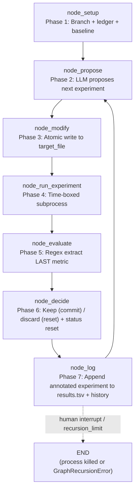

<- Back to [Autoresearch Overview](../AUTORESEARCH.md)

# 🏗️ Architecture

Module tree, dispatch flow (mermaid), design decisions, state TypedDict. For facade signature + per-node reference see [API.md](API.md). For AI-editing rules see [INSTRUCTIONS.md](INSTRUCTIONS.md).

---

## 🌳 Module Tree

```text
workflows/autoresearch.py
├── build_autoresearch_graph()        # Re-exported from autoresearch_impl/graph.py
└── WORKFLOW_METADATA                 # Re-exported (name="autoresearch", version="1.3.0")

workflows/autoresearch_impl/
├── __init__.py                       # Empty
├── state.py
│   ├── AutoresearchState             # TypedDict(WorkflowState, total=False)
│   └── _default_state(...)           # Factory pulling defaults from cfg
├── graph.py
│   ├── WORKFLOW_METADATA             # MCP client introspection dict (v1.3.0)
│   └── build_autoresearch_graph()    # 7-node StateGraph builder (direct edges only)
├── routes.py
│   └── route_after_setup             # success → propose, failure → END
│                                     # [v1.3 P2-5] route_after_evaluate + route_after_decide DELETED
├── helpers.py
│   ├── extract_metric()              # [v1.2.1] shared regex (setup + evaluate)
│   └── run_target_subprocess()       # [v1.3 P2-1] shared subprocess runner (setup + run_experiment)
└── nodes/
    ├── __init__.py
    ├── setup.py                      # node_setup — branch + ledger + baseline
    ├── propose.py                    # node_propose — LLM proposal (subagent, 3× retry)
    ├── modify.py                     # node_modify — atomic write + path/protected guards
    ├── run_experiment.py             # node_run_experiment — time-boxed subprocess
    ├── evaluate.py                   # node_evaluate — regex metric extraction
    ├── decide.py                     # node_decide — keep (commit) / discard (reset) + status reset
    └── log.py                        # node_log — append to results.tsv + history (capped at 100)
```

**External dependencies (lazy-imported inside node functions):**
- `workflows/base.py` — `WorkflowState` (parent TypedDict) + `run_workflow()` dispatcher. **[v1.3 P0-2]** Autoresearch branch catches `GraphRecursionError` and returns `{"status": "success"}`.
- `core/config.py` — 4 autoresearch knobs + `cfg.is_protected()` (v1.3 P1-3) + `cfg.autocode_max_file_chars` (6000, v1.3 P1-5).
- `core/json_extract.py` — `extract_json()` (used by `node_propose._parse_proposal()` to strip markdown fences).
- `core/tracer.py` — `tracer.step()` / `tracer.warning()` / `tracer.error()` — observability (MCP stdio safety — no `print()`).
- `tools/agent.py` — `agent(action="subagent", role="planner")` — used by `node_propose._call_planner` (v1.1+).
- `tools/git.py` — `git(action="checkout_new"|"checkout_branch")` — used by `node_setup` only (NOT `node_decide`, which uses raw `subprocess.run`).
- `tools/workflow_ops/{types/autoresearch.py,helpers.py}` — type handler + `_execute_workflow()`. **[v1.3 P2-2]** Forwards ALL autoresearch params.
- `tests/workflows/autoresearch/` — per-concern test files (see [Testing](#-testing) below).

---

## 🔀 Dispatch Flow



- **[v1.3 P0-1] Graph order:** `setup → propose → modify → run_experiment → evaluate → decide → log → propose (loop)`. OLD order (`evaluate → log → decide`) was broken — `log` read `current_experiment.status` BEFORE `decide` annotated it → ledger ALWAYS recorded `"discard"`. NEW order lets `decide` annotate first, then `log` writes the correct status. `status="running"` reset moved from `node_log` to `node_decide`.
- **[v1.3 P2-5] Direct edges after `run_experiment`** — the two pre-v1.3 "fake" conditionals (`route_after_evaluate` always→`"log"`, `route_after_decide` always→`"propose"`) were deleted → direct `add_edge` calls.
- **[v1.3 P0-2] `GraphRecursionError` is the EXPECTED exit** — the dispatcher's autoresearch branch catches it explicitly and returns `{"status": "success"}` with the trace_id (was: caught by generic `except Exception` → `status="failed"`, state lost).
- **Capacity:** With `recursion_limit=1000`, ~166 experiments per invocation. Invoke graph directly with a higher limit for longer runs.

---

## 🧠 State TypedDict

Defined in `workflows/autoresearch_impl/state.py`. Extends `WorkflowState` and adds autoresearch-specific fields. `total=False` because LangGraph nodes return PARTIAL dicts.

```python
class AutoresearchState(WorkflowState, total=False):
    # -- Inputs --
    goal: str                  # what to optimize, e.g. "minimize val_bpb"
    trace_id: str
    project_root: str          # git repo root where experiments run
    target_file: str           # the file to modify, e.g. "train.py"
    metric_name: str           # e.g. "val_bpb"
    metric_direction: str      # "lower" or "higher"
    time_budget: int           # seconds per experiment run (default 300)
    branch: str                # git branch name for experiments
    results_path: str          # path to results.tsv ledger

    # -- Loop bookkeeping --
    experiment_count: int
    baseline_metric: float     # metric from the unmodified target_file
    current_best: float        # best metric seen so far

    # -- Per-iteration state (each history entry: {iteration, description, metric, status, commit}) --
    experiment_history: list[dict]
    current_experiment: dict   # the proposed experiment being run
    experiment_output: str     # stdout+stderr from the last experiment run
    current_metric: float      # metric extracted from the last run

    # -- LangGraph plumbing --
    messages: Annotated[list[AnyMessage], add_messages]
    status: str                # "running" | "success" | "failed"
    error: str
    result: str
```

For the field-by-field reference table, see [API.md § State Fields](API.md#-state-fields-autoresearchstate). `_default_state(...)` is the factory — pulls defaults from `cfg`.

---

## 💡 Key Design Decisions

- **Evolutionary loop (not convergent)** — Unlike `autocode` (convergent: iterate until tests pass), autoresearch is evolutionary: many experiments, one branch, results.tsv ledger. No "done" state — loop runs until a human stops it. Mirrors karpathy/autoresearch.
- **Indefinite execution via unconditional back-edge** — `log → propose` is a direct edge (v1.3 P2-5 — was a fake conditional `route_after_decide`). No condition exits the loop. LangGraph's `recursion_limit` is the only safety cap; `GraphRecursionError` is the EXPECTED exit (v1.3 P0-2 catches it and returns success).
- **[v1.3 P0-1] Graph order: evaluate → decide → log** — OLD order (`evaluate → log → decide`) caused ledger to ALWAYS record `"discard"` — `log` read `current_experiment.status` BEFORE `decide` annotated it. Worse, `log` reset `status="running"` AFTER `decide` ran, so `decide` never saw `evaluate`'s `"failed"` status → failed experiments could be committed as improvements. NEW order fixes both.
- **Git-based keep/discard via raw `subprocess.run` (not the `git` tool)** — `git` tool wraps every call in `tracer.step` + compression (noise during tight loop). Git is the safety net: improvements committed; failures `git reset --hard HEAD` + `git clean -fd`.
- **[v1.3 P1-1] Empty SHA = discard** — `_git_commit` returns `""` on failure (hook rejection, nothing to commit, timeout). Pre-v1.3 set `status="keep"` with empty commit — ambiguous ledger entry. v1.3: empty SHA → discard (don't update `current_best`, run `_git_reset_hard`).
- **[v1.3 P1-4] git reset safety guard** — `_git_reset_hard` refuses to reset without explicit `project_root` or when `project_root` isn't a git repo. Prevents accidentally resetting the agent's own working tree.
- **Atomic writes** — `node_modify._atomic_write` uses `tempfile.mkstemp(dir=path.parent)` + `os.fsync` + `os.replace`. Same-filesystem rename is atomic (POSIX + Windows). On failure, tempfile is `os.unlink`'d (no `.tmp` leaks); readers never see a half-written `target_file`.
- **[v1.3 P1-3] Path traversal + protected-file guards** — `node_modify` checks `target_path.resolve().relative_to(project_root.resolve())` (refuses `../` escapes) + `cfg.is_protected(target_path)` (refuses `.env`, `pyproject.toml`, agent source). Both → `status="failed"`; `decide` discards.
- **Results ledger (`results.tsv`)** — Every experiment (keep OR discard) appended as TSV: `iteration\tcommit\tmetric\tstatus\tdescription`. Human audit trail (`tail -f` while loop runs; `awk -F'\t' '$4=="keep"'` for wins). In-memory `experiment_history` is the LLM's view (capped at 100, v1.3 P2-3; last 20 formatted into the proposal prompt).
- **[v1.3 P1-2] Subagent retry** — `_call_planner` retries 3× with exponential backoff (2s, 4s). After all 3 fail, raises `RuntimeError`; `node_propose` returns `status="failed"` (decide discards).
- **Subagent dispatch (not `_call()`)** — `node_propose._call_planner` calls `agent(action="subagent", role="planner")` for isolated curated-context LLM dispatch (v1.1+). Subagent gets a fresh LLM call with NO session history — only experiment history + target file content. NO `_call()` fallback (v1.2.2 doc fix).
- **Lazy imports for tools** — `tools.git`, `tools.agent`, `core.json_extract` imported INSIDE node functions (avoids circular imports — `tools.*` may transitively import `workflows.*`).
- **State TypedDict extends WorkflowState** — `AutoresearchState(WorkflowState, total=False)` adds autoresearch-specific fields. `total=False` because LangGraph nodes return PARTIAL dicts.
- **Equality is NOT an improvement** — `node_decide._is_improvement` returns `False` when `new == best`. Discourage no-op changes. Strict inequality only.

---

## 🧪 Testing

```bash
python -m pytest tests/workflows/autoresearch/ -v -W error --tb=short
```

**78/78 autoresearch tests pass** with `-W error` (per-node unit tests + integration + graph topology).

**Mock strategy:** Patch `workflows.autoresearch_impl.graph.node_<name>` for end-to-end loop tests; patch `nodes.decide._git_commit` / `_git_reset_hard` for `node_decide` unit tests; patch `tools.git.git` for `node_setup._git_create_branch`. No live LLM/subprocess/git operations.

**Test layout:**

```text
tests/workflows/autoresearch/
├── conftest.py                  # Shared `ar_state` fixture
├── test_graph.py                # Topology + WORKFLOW_METADATA + facade + full-loop integration
├── test_nodes_setup.py          # extract_metric + run_target_subprocess + node_setup + node_evaluate
├── test_nodes_propose.py        # _format_history + _parse_proposal + _call_planner + node_propose + _atomic_write + node_modify
├── test_nodes_decide.py         # _is_improvement + _git_commit + _git_reset_hard + node_decide + node_log
└── test_nodes_run.py            # node_run_experiment + run_target_subprocess (run-time)
```

The dispatcher test (`tests/workflows/base/test_dispatcher.py`) asserts the unknown-type error message includes `"autoresearch"` in the valid workflow types list.

---

*Last updated: 2026-07-20 (v1.3). See [CHANGELOG.md](CHANGELOG.md) for version history.*
