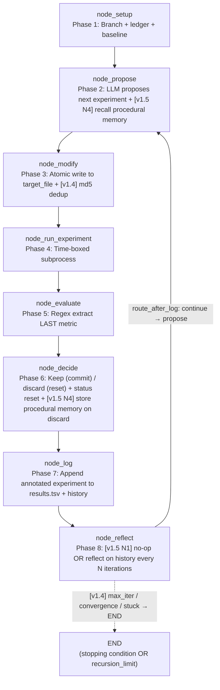

<- Back to [Autoresearch Overview](../AUTORESEARCH.md)

# 🏗️ Architecture

Module tree, dispatch flow (mermaid), design decisions, state TypedDict. For facade signature + per-node reference see [API.md](API.md). For AI-editing rules see [INSTRUCTIONS.md](INSTRUCTIONS.md).

---

## 🌳 Module Tree

```text
workflows/autoresearch.py
├── build_autoresearch_graph()        # Re-exported from autoresearch_impl/graph.py
└── WORKFLOW_METADATA                 # Re-exported (name="autoresearch", version="1.8")

workflows/autoresearch_impl/
├── __init__.py                       # Empty
├── state.py
│   ├── AutoresearchState             # TypedDict(WorkflowState, total=False)
│   └── _default_state(...)           # Factory pulling defaults from cfg (incl. v1.4 loop-control knobs + v1.5 reflect_notes + v1.6 parallel_count + v1.8 pre_extracted_metric)
├── graph.py
│   ├── WORKFLOW_METADATA             # MCP client introspection dict (v1.8)
│   └── build_autoresearch_graph()    # 8-node StateGraph builder (1 conditional loop edge from reflect)
├── routes.py
│   ├── route_after_setup             # success → propose, failure → END
│   └── route_after_log               # [v1.4] continue → propose, stop → END (max_iter / convergence / stuck)
│                                     # [v1.5 N1] now invoked from `reflect` (was `log`)
│                                     # [v1.3 P2-5] route_after_evaluate + route_after_decide DELETED
├── helpers.py
│   ├── extract_metric()              # [v1.2.1] shared regex (setup + evaluate + run_experiment [v1.8 N10])
│   └── run_target_subprocess()       # [v1.3 P2-1] shared subprocess runner (setup + run_experiment)
└── nodes/
    ├── __init__.py
    ├── setup.py                      # node_setup — branch + ledger + baseline + [v1.7 N3] resume: skip branch/baseline + reload history from ledger
    ├── propose.py                    # node_propose — LLM proposal (subagent, 3× retry) + [v1.5 N1] reflect_notes block + [v1.5 N4] procedural memory recall + [v1.6] parallel N-proposal path + [v1.8 N6] _call_planner returns (response, usage) tuple + captures tokens on proposal
    ├── modify.py                     # node_modify — atomic write + path/protected guards + [v1.4 N8] md5 dedup + [v1.6] parallel N-temp-dirs path under .autoresearch/parallel/{i}/
    ├── run_experiment.py             # node_run_experiment — time-boxed subprocess + [v1.6] parallel N-subprocess path + [v1.8 N5] full output logged to {results_path}.d/{iteration}.log BEFORE truncation + [v1.8 N10] pre-extract metric from full output before truncation
    ├── evaluate.py                   # node_evaluate — regex metric extraction + [v1.6] parallel N-metric extraction + [v1.8 N10] reads pre_extracted_metric FIRST (skips re-extraction from truncated output)
    ├── decide.py                     # node_decide — keep (commit) / discard (reset) + status reset + [v1.5 N4] _record_failure_memory on discard + [v1.6] parallel pick-best + copy winner to real target_file + cleanup temp dir + [v1.7 N7] save_checkpoint on every keep (single + parallel)
    ├── log.py                        # node_log — append to results.tsv + history (capped at 100) + [v1.4] content_hash + [v1.6] parallel N-row ledger + [v1.8 N6] tokens field in history entries
    └── reflect.py                    # [v1.5 N1] node_reflect — LLM strategy reflection every N iterations (no-op otherwise) + [v1.8 N6] unpacks _call_planner tuple (discards usage)
```

**External dependencies (lazy-imported inside node functions):**
- `workflows/base.py` — `WorkflowState` (parent TypedDict) + `run_workflow()` dispatcher. **[v1.3 P0-2]** Autoresearch branch catches `GraphRecursionError` and returns `{"status": "success"}`.
- `core/config.py` — 4 autoresearch knobs + 3 v1.4 loop-control knobs + 1 v1.5 reflect knob + 1 v1.6 parallel knob + `cfg.is_protected()` (v1.3 P1-3) + `cfg.autocode_max_file_chars` (6000, v1.3 P1-5).
- `core/json_extract.py` — `extract_json()` (used by `node_propose._parse_proposal()` to strip markdown fences).
- `core/tracer.py` — `tracer.step()` / `tracer.warning()` / `tracer.error()` — observability (MCP stdio safety — no `print()`).
- `tools/agent.py` — `agent(action="subagent", role="planner")` — used by `node_propose._call_planner` (v1.1+) + `node_reflect` (v1.5 N1, reuses the same helper).
- `core/memory_engine.py` — `memory.recall()` + `memory.store_procedural()` — used by `node_propose` (v1.5 N4, recall procedural memories before proposing) + `node_decide` (v1.5 N4, store procedural memory on discard). Lazy-imported + wrapped in try/except (non-fatal — chromadb may be unavailable).
- `tools/git.py` — `git(action="checkout_new"|"checkout_branch")` — used by `node_setup` only (NOT `node_decide`, which uses raw `subprocess.run`).
- `tools/workflow_ops/{types/autoresearch.py,helpers.py}` — type handler + `_execute_workflow()`. **[v1.3 P2-2]** Forwards ALL autoresearch params. **[v1.4]** Forwards `max_iterations`. **[v1.6]** Forwards `parallel_count`. **[v1.7 N3]** Forwards `resume` (already in the type handler signature; passed through `_execute_workflow` → `run_workflow` → autoresearch dispatch).
- `core/observability/checkpoint.py` — **[v1.7 N7]** `save_checkpoint(trace_id, "keep", state)` called from `node_decide` after every successful `_git_commit`; `get_latest(trace_id)` called from the dispatcher's autoresearch branch when `resume=True` to restore the last-known-good state.
- `tests/workflows/autoresearch/` — per-concern test files (see [Testing](#-testing) below).

---

## 🔀 Dispatch Flow



- **[v1.3 P0-1] Graph order:** `setup → propose → modify → run_experiment → evaluate → decide → log → propose (loop)`. OLD order (`evaluate → log → decide`) was broken — `log` read `current_experiment.status` BEFORE `decide` annotated it → ledger ALWAYS recorded `"discard"`. NEW order lets `decide` annotate first, then `log` writes the correct status. `status="running"` reset moved from `node_log` to `node_decide`.
- **[v1.3 P2-5] Direct edges after `run_experiment`** — the two pre-v1.3 "fake" conditionals (`route_after_evaluate` always→`"log"`, `route_after_decide` always→`"propose"`) were deleted → direct `add_edge` calls.
- **[v1.4] Conditional `log → propose` back-edge** — replaced the v1.3 direct edge with `route_after_log`, which checks 3 stopping conditions in order: (1) `max_iterations` reached (caller-set hard cap; 0=unlimited); (2) convergence: last N all discarded (N=`convergence_window`, default 10); (3) stuck: last N metrics all within ε of `current_best` (ε=`convergence_epsilon`, default 0.001). All 3 default OFF → v1.4 preserves v1.3 "loop forever" behavior unless caller opts in via `max_iterations=N` or env vars.
- **[v1.5 N1] Reflect node between `log` and `route_after_log`** — `node_reflect` is a no-op most iterations (returns `{}`). Every `autoresearch_reflect_interval` iterations (default 5; 0=disabled) it calls the planner LLM with `REFLECT_SYSTEM` + the full experiment history and stores the strategy summary in `state["reflect_notes"]`. The next `node_propose` surfaces the reflection in its prompt (when non-empty) so the LLM has strategic context, not just raw history. Failures are non-fatal — `node_reflect` returns `{}` on LLM error so the loop continues with whatever reflection was previously stored. The conditional edge `route_after_log` now starts from `reflect` (was `log`) — `log → reflect → route_after_log → propose` is the new loop tail.
- **[v1.5 N4] Cross-run learning** — `node_decide` calls `_record_failure_memory()` on every discard path (prior-failure AND no-improvement). The helper lazily imports `core.memory_engine.memory`, checks if a similar failure has been recorded before (via `memory.recall(collections=["procedural"], min_score=0.7)`) — if yes, traces a "repeated failure pattern detected" log line; if no, calls `memory.store_procedural()` with `importance=5`, `tags="source:autoresearch,category:failed_experiment"`, `outcome="failure"`. `node_propose` lazily recalls procedural memories before generating the next proposal (via `memory.recall(collections=["procedural"], top_k=3, min_score=0.3)`) and surfaces them in the prompt as "Past learned rules". All memory calls are wrapped in try/except — if `core.memory_engine` is unavailable (e.g. chromadb not installed), cross-run learning silently no-ops. This is non-blocking on the experiment loop.
- **[v1.6] Node-internal parallelism (batch mode)** — When `parallel_count > 1`, each iteration runs N experiments in parallel: `node_propose` dispatches N `_call_planner` calls via `ThreadPoolExecutor(max_workers=N)` (each with the SAME prompt — the LLM produces different proposals via sampling temperature); `node_modify` writes each proposal to its own temp dir under `{project_root}/.autoresearch/parallel/{i}/{target_file}` (the REAL `target_file` is NOT touched in parallel mode — only `node_decide` copies the winner back); `node_run_experiment` runs N subprocesses concurrently in their own temp dirs as cwd; `node_evaluate` extracts N metrics; `node_decide` picks the best (greedy `min`/`max` over the N metrics, skipping any proposal marked `status="failed"` by modify), copies the winner's content to the real `target_file`, git commits it, annotates losers as `status="discard"`, and `shutil.rmtree`s the temp dir; `node_log` writes N ledger rows + N history entries (experiment_count increments by N). When `parallel_count == 1` (default), ALL nodes behave EXACTLY as v1.5 (single-experiment, singular state fields only). The graph topology is UNCHANGED — parallelism is node-internal, coordinated via the `parallel_count` state field. Per-call LLM failures are recorded as failed-proposal placeholders so the batch isn't aborted by one bad call.
- **[v1.7 N3 + N7] Resume + checkpoint** — `run_workflow(resume=True)` triggers checkpoint restore for autoresearch. The dispatcher's autoresearch branch calls `core.observability.checkpoint.get_latest(trace_id)` AFTER `_ar_default(...)` builds a fresh state; if a checkpoint exists, it merges in only the autoresearch-specific fields (`experiment_count`, `current_best`, `baseline_metric`, `experiment_history`, `branch`, `results_path`, `reflect_notes`) — caller params (`goal`, `target_file`, etc.) are preserved as-is. It then sets `ar_state["resume"] = True`. `node_setup` reads this flag: when `resume=True` AND `state["branch"]` is non-empty, branch creation is skipped (the prior run's branch is reused); when `state["current_best"] > 0.0`, the baseline run is ALSO skipped, and `experiment_history` is reloaded from `results.tsv` via the new `_load_history_from_ledger` helper (parses TSV rows back into `{iteration, commit, metric, status, description}` dicts). `experiment_count` is set to `len(history)`. When `resume=False` (default), behavior is exactly v1.6. To support resume, `node_decide` calls `save_checkpoint(tid, "keep", state)` after every successful `_git_commit` (both single-experiment AND parallel paths) — the saved state includes the updated `current_best` so a crashed run resumes from the last-known-good metric. Discard paths do NOT checkpoint (the working tree was reset to the prior HEAD — no recoverable state worth resuming from). Checkpoint write failures are non-fatal (try/except) so the experiment loop is never blocked by a checkpoint-disk error.
- **[v1.8 N5 + N6 + N10] Observability** — Three observability features layered on top of v1.7. **N5 (output logging):** `node_run_experiment` writes the FULL stdout+stderr to `{results_path}.d/{iteration}.log` (single mode) or `{results_path}.d/{iteration}_{i}.log` (parallel mode, one per experiment) BEFORE truncating to 50KB. Operators can `cat {results_path}.d/42.log` to inspect the full output for debugging when the truncated state copy doesn't have enough context. The log dir is a sibling of `results.tsv` (the `.d` suffix mirrors the Unix "directory" convention). Non-fatal — disk errors are swallowed so the experiment loop is never blocked. **N6 (cost/token tracking):** `_call_planner` now returns a `(response, usage)` tuple (was: just the response string). `usage` is the dict from the subagent dispatch (has `total` / `prompt` / `completion` token counts). `node_propose` captures `usage.get("total", 0)` on the proposal as `tokens` (both single and parallel paths). `node_log._build_history_entry` persists `tokens` in `experiment_history` entries — operators can sum `tokens` across entries to estimate LLM cost per run. When `usage` is missing or malformed (older subagent versions, mocked tests), `tokens` defaults to 0. `node_reflect` also calls `_call_planner` but discards the usage (reflection isn't an experiment — its tokens aren't tracked in `experiment_history`). **N10 (truncation fix):** `node_run_experiment` (single path) now extracts the metric from the FULL output BEFORE truncating to 50KB and stores it in new `pre_extracted_metric` state field. `node_evaluate` (single path) reads this FIRST and skips re-extracting from the (possibly truncated) `experiment_output` — prevents false negatives when the metric was printed early and the script produced lots of output after, pushing the metric out of the 50KB tail. When `pre_extracted_metric` is None (no metric in the full output), evaluate falls through to the existing extraction-from-output path (which will also yield None → status="failed"). Parallel paths unchanged — parallel `evaluate` already handles per-output extraction; `pre_extracted_metric` is explicitly cleared to `None` in parallel `run_experiment` to avoid stale-state leakage across mode switches.
- **[v1.3 P0-2] `GraphRecursionError` is the EXPECTED exit** — the dispatcher's autoresearch branch catches it explicitly and returns `{"status": "success"}` with the trace_id (was: caught by generic `except Exception` → `status="failed"`, state lost).
- **Capacity:** With `recursion_limit=1000`, ~166 experiments per invocation (8 nodes per iteration: setup + 7 loop nodes). With `max_iterations=N` (v1.4 opt-in), the loop stops at N regardless of recursion_limit. With `parallel_count=M` (v1.6), each iteration produces M experiments — effective experiment throughput is M× the single-mode rate (subject to LLM + subprocess parallelism limits). Invoke graph directly with a higher limit for longer runs.

---

## 🧠 State TypedDict

Defined in `workflows/autoresearch_impl/state.py`. Extends `WorkflowState` and adds autoresearch-specific fields. `total=False` because LangGraph nodes return PARTIAL dicts.

```python
class AutoresearchState(WorkflowState, total=False):
    # -- Inputs --
    goal: str                  # what to optimize, e.g. "minimize val_bpb"
    trace_id: str
    project_root: str          # git repo root where experiments run
    target_file: str           # the file to modify, e.g. "train.py"
    metric_name: str           # e.g. "val_bpb"
    metric_direction: str      # "lower" or "higher"
    time_budget: int           # seconds per experiment run (default 300)
    branch: str                # git branch name for experiments
    results_path: str          # path to results.tsv ledger

    # -- Loop bookkeeping --
    experiment_count: int
    baseline_metric: float     # metric from the unmodified target_file
    current_best: float        # best metric seen so far

    # -- [v1.4] Loop control --
    max_iterations: int        # 0=unlimited; stop after N experiments
    convergence_window: int    # stop after N consecutive non-improvements
    convergence_epsilon: float # metric plateau threshold (stuck detector)

    # -- [v1.5 N1] Reflect node --
    reflect_notes: str         # LLM strategy reflection (updated every N iterations)

    # -- [v1.6] Parallel experiments (batch mode) --
    parallel_count: int          # N parallel experiments per iteration (1 = v1.5 single mode)
    current_experiments: list[dict]  # N proposals being evaluated (parallel mode only)
    experiment_outputs: list[str]    # N outputs from N subprocesses (parallel mode only)
    current_metrics: list[float]     # N metrics from N evaluations (parallel mode only)

    # -- [v1.7 N3] Resume support --
    resume: bool                # True = skip baseline + branch, reload history from ledger

    # -- [v1.8 N10] Pre-extracted metric (truncation safety) --
    # Set by node_run_experiment (single path) to the metric extracted from the
    # FULL output BEFORE truncation to 50KB. node_evaluate reads this first and
    # skips re-extracting from the (possibly truncated) experiment_output.
    # None when no metric was found in the full output. Parallel mode does NOT
    # populate this field (parallel evaluate extracts per-output directly).
    pre_extracted_metric: Optional[float]

    # -- Per-iteration state (each history entry: {iteration, description, metric, status, commit, content_hash, tokens}) --
    # [v1.4] content_hash added for dedup (N8) — md5 of new_content.
    # [v1.8 N6] tokens added — total LLM tokens used by the planner call.
    experiment_history: list[dict]
    current_experiment: dict   # the proposed experiment being run
    experiment_output: str     # stdout+stderr from the last experiment run (truncated to 50KB)
    current_metric: float      # metric extracted from the last run

    # -- LangGraph plumbing --
    messages: Annotated[list[AnyMessage], add_messages]
    status: str                # "running" | "success" | "failed"
    error: str
    result: str
```

For the field-by-field reference table, see [API.md § State Fields](API.md#-state-fields-autoresearchstate). `_default_state(...)` is the factory — pulls defaults from `cfg`.

---

## 💡 Key Design Decisions

- **Evolutionary loop (not convergent)** — Unlike `autocode` (convergent: iterate until tests pass), autoresearch is evolutionary: many experiments, one branch, results.tsv ledger. No "done" state — loop runs until a human stops it. Mirrors karpathy/autoresearch.
- **Indefinite execution via unconditional back-edge** — `log → propose` is a direct edge (v1.3 P2-5 — was a fake conditional `route_after_decide`). No condition exits the loop. LangGraph's `recursion_limit` is the only safety cap; `GraphRecursionError` is the EXPECTED exit (v1.3 P0-2 catches it and returns success).
- **[v1.4] Opt-in loop control** — `route_after_log` (replacing the v1.3 direct `log → propose` edge) checks 3 stopping conditions: `max_iterations` (caller-set hard cap; 0=unlimited), convergence (last N all discarded), stuck (last N metrics within ε of best). All default OFF → v1.3 "loop forever" behavior preserved unless caller opts in. Each condition requires `len(history) >= window` so the first few iterations never false-positive. Detector is conservative on purpose: an overnight run that's making progress should NEVER auto-stop. Semantic dedup (N4) deferred — v1.4 N8 only dedups EXACT `new_content` matches via md5.
- **[v1.4 N8] Experiment deduplication** — `node_modify` md5-hashes `new_content` BEFORE the write. If the hash matches any prior experiment's `content_hash` in `experiment_history`, the write is skipped and `status="failed"` is returned with a "duplicate" error. Prevents the LLM from re-proposing the exact same change (which the loop would otherwise re-run + re-evaluate pointlessly). The hash is stored on `current_experiment.content_hash` (by `node_modify`) and persisted in `experiment_history` entries (by `node_log`) for future dedup checks.
- **[v1.3 P0-1] Graph order: evaluate → decide → log** — OLD order (`evaluate → log → decide`) caused ledger to ALWAYS record `"discard"` — `log` read `current_experiment.status` BEFORE `decide` annotated it. Worse, `log` reset `status="running"` AFTER `decide` ran, so `decide` never saw `evaluate`'s `"failed"` status → failed experiments could be committed as improvements. NEW order fixes both.
- **Git-based keep/discard via raw `subprocess.run` (not the `git` tool)** — `git` tool wraps every call in `tracer.step` + compression (noise during tight loop). Git is the safety net: improvements committed; failures `git reset --hard HEAD` + `git clean -fd`.
- **[v1.3 P1-1] Empty SHA = discard** — `_git_commit` returns `""` on failure (hook rejection, nothing to commit, timeout). Pre-v1.3 set `status="keep"` with empty commit — ambiguous ledger entry. v1.3: empty SHA → discard (don't update `current_best`, run `_git_reset_hard`).
- **[v1.3 P1-4] git reset safety guard** — `_git_reset_hard` refuses to reset without explicit `project_root` or when `project_root` isn't a git repo. Prevents accidentally resetting the agent's own working tree.
- **Atomic writes** — `node_modify._atomic_write` uses `tempfile.mkstemp(dir=path.parent)` + `os.fsync` + `os.replace`. Same-filesystem rename is atomic (POSIX + Windows). On failure, tempfile is `os.unlink`'d (no `.tmp` leaks); readers never see a half-written `target_file`.
- **[v1.3 P1-3] Path traversal + protected-file guards** — `node_modify` checks `target_path.resolve().relative_to(project_root.resolve())` (refuses `../` escapes) + `cfg.is_protected(target_path)` (refuses `.env`, `pyproject.toml`, agent source). Both → `status="failed"`; `decide` discards.
- **Results ledger (`results.tsv`)** — Every experiment (keep OR discard) appended as TSV: `iteration\tcommit\tmetric\tstatus\tdescription`. Human audit trail (`tail -f` while loop runs; `awk -F'\t' '$4=="keep"'` for wins). In-memory `experiment_history` is the LLM's view (capped at 100, v1.3 P2-3; last 20 formatted into the proposal prompt).
- **[v1.3 P1-2] Subagent retry** — `_call_planner` retries 3× with exponential backoff (2s, 4s). After all 3 fail, raises `RuntimeError`; `node_propose` returns `status="failed"` (decide discards).
- **Subagent dispatch (not `_call()`)** — `node_propose._call_planner` calls `agent(action="subagent", role="planner")` for isolated curated-context LLM dispatch (v1.1+). Subagent gets a fresh LLM call with NO session history — only experiment history + target file content. NO `_call()` fallback (v1.2.2 doc fix).
- **Lazy imports for tools** — `tools.git`, `tools.agent`, `core.json_extract` imported INSIDE node functions (avoids circular imports — `tools.*` may transitively import `workflows.*`).
- **State TypedDict extends WorkflowState** — `AutoresearchState(WorkflowState, total=False)` adds autoresearch-specific fields. `total=False` because LangGraph nodes return PARTIAL dicts.
- **Equality is NOT an improvement** — `node_decide._is_improvement` returns `False` when `new == best`. Discourage no-op changes. Strict inequality only.

---

## 🧪 Testing

```bash
python -m pytest tests/workflows/autoresearch/ -v -W error --tb=short
```

**Mock strategy:** Patch `workflows.autoresearch_impl.graph.node_<name>` for end-to-end loop tests; patch `nodes.decide._git_commit` / `_git_reset_hard` for `node_decide` unit tests; patch `tools.git.git` for `node_setup._git_create_branch`. **[v1.8 N6]** Tests that mock `_call_planner` must return a `(response, usage)` tuple (was: just a response string). No live LLM/subprocess/git operations.

**Test layout:**

```text
tests/workflows/autoresearch/
├── conftest.py                  # Shared `ar_state` fixture
├── test_graph.py                # Topology + WORKFLOW_METADATA + facade + full-loop integration
├── test_loop_control.py         # [v1.4] route_after_log + experiment dedup (8 tests)
├── test_reflect.py              # [v1.5] node_reflect + propose reflection block + cross-run learning (12 tests)
├── test_parallel.py             # [v1.6] parallel_count=1 backward compat + parallel_count>1 path (20 tests)
├── test_resume.py               # [v1.7] resume: skip baseline/branch + reload history + checkpoint on keep (8 tests)
├── test_observability.py        # [v1.8] N5 output logging + N6 token tracking + N10 pre-extract metric (20 tests)
├── test_nodes_setup.py          # extract_metric + run_target_subprocess + node_setup + node_evaluate
├── test_nodes_propose.py        # _format_history + _parse_proposal + _call_planner (tuple) + node_propose + _atomic_write + node_modify
├── test_nodes_decide.py         # _is_improvement + _git_commit + _git_reset_hard + node_decide + node_log
└── test_nodes_run.py            # node_run_experiment + run_target_subprocess (run-time) + [v1.8 N10] pre-extract
```

**146/146 autoresearch tests pass** with `-W error` (per-node unit tests + integration + graph topology + v1.4 loop-control + v1.5 reflect + cross-run learning + v1.6 parallel + v1.7 resume + checkpoint + v1.8 observability).

---

*Last updated: 2026-07-23 (v1.8). See [CHANGELOG.md](CHANGELOG.md) for version history.*
