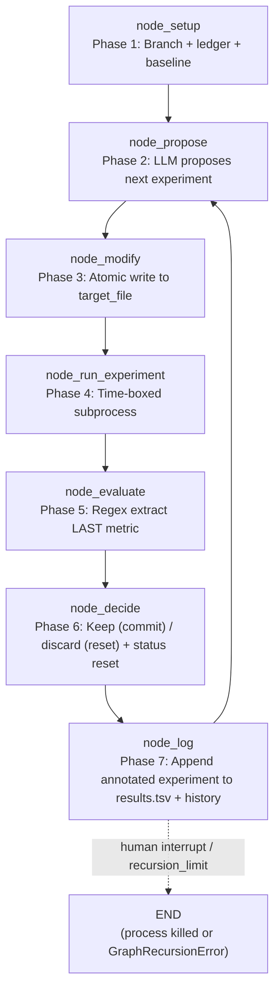

<- Back to [Autoresearch Overview](../AUTORESEARCH.md)

# 🏗️ Architecture

## 🔗 Source Code Reference

| File | Purpose |
|------|---------|
| `workflows/autoresearch.py` | Thin facade — re-exports `build_autoresearch_graph` + `WORKFLOW_METADATA`. No business logic. |
| `workflows/autoresearch_impl/__init__.py` | Empty package init. |
| `workflows/autoresearch_impl/state.py` | `AutoresearchState` TypedDict (extends `WorkflowState`, `total=False`) + `_default_state()` factory. |
| `workflows/autoresearch_impl/graph.py` | `build_autoresearch_graph()` — 7-node LangGraph StateGraph builder. `WORKFLOW_METADATA` dict (version `"1.3.0"`). [v1.3] Uses direct edges for evaluate→decide + decide→log + log→propose (was fake conditionals). |
| `workflows/autoresearch_impl/routes.py` | `route_after_setup` only (success → propose, failure → END). [v1.3 P2-5] `route_after_evaluate` + `route_after_decide` DELETED (fake conditionals → direct edges). |
| `workflows/autoresearch_impl/helpers.py` | `extract_metric()` (shared regex, v1.2.1) + `run_target_subprocess()` (shared subprocess runner, v1.3 P2-1). |
| `workflows/autoresearch_impl/nodes/setup.py` | `node_setup` — git branch + `results.tsv` ledger + baseline experiment. Hosts `_git_create_branch`. [v1.3 P2-1] `_run_experiment_subprocess` removed (now in helpers). |
| `workflows/autoresearch_impl/nodes/propose.py` | `node_propose` — LLM planner call via `agent(action="subagent", role="planner")`. Hosts `_PROPOSE_SYSTEM` prompt, `_format_history`, `_read_target_file`, `_call_planner` (3× retry, v1.3 P1-2), `_parse_proposal`. [v1.3 P1-5] Caps target file content at `cfg.autocode_max_file_chars`. |
| `workflows/autoresearch_impl/nodes/modify.py` | `node_modify` — atomic write (`tempfile.mkstemp` + `os.fsync` + `os.replace`). Hosts `_atomic_write`. [v1.3 P1-3] Path traversal + protected-file guards. |
| `workflows/autoresearch_impl/nodes/run_experiment.py` | `node_run_experiment` — time-boxed subprocess execution. [v1.3 P2-1] `_run_subprocess` removed (now in helpers). |
| `workflows/autoresearch_impl/nodes/evaluate.py` | `node_evaluate` — regex metric extraction (last occurrence). Hosts `_extract_metric` (imported from helpers). |
| `workflows/autoresearch_impl/nodes/decide.py` | `node_decide` — keep (git commit) / discard (git reset). Hosts `_is_improvement`, `_git_commit`, `_git_reset_hard`. [v1.3 P0-1] Resets `status="running"` (was: log's job). [v1.3 P1-1] Empty SHA → discard. [v1.3 P1-4] `_git_reset_hard` safety guard. |
| `workflows/autoresearch_impl/nodes/log.py` | `node_log` — append to `results.tsv` + update `experiment_history`. Hosts `_append_to_ledger`. [v1.3 P0-1] No longer resets `status` (decide does). [v1.3 P2-3] Caps `experiment_history` at 100. |
| `workflows/base.py` | `WorkflowState` (parent TypedDict) + `run_workflow()` dispatcher. [v1.3 P0-2] Autoresearch branch catches `GraphRecursionError` and returns `{"status": "success"}` with the trace_id (was: caught by generic `except Exception` → `status="failed"` + state lost). |
| `core/config.py` | 4 autoresearch knobs: `autoresearch_time_budget` (300), `autoresearch_target_file` ("train.py"), `autoresearch_metric_name` ("val_bpb"), `autoresearch_metric_direction` ("lower"). Also `cfg.is_protected()` (v1.3 P1-3) and `cfg.autocode_max_file_chars` (6000, v1.3 P1-5). |
| `core/json_extract.py` | `extract_json()` — used by `node_propose._parse_proposal()` to strip markdown fences from LLM JSON. |
| `core/tracer.py` | `tracer.step()` / `tracer.warning()` / `tracer.error()` — observability. All nodes log via tracer (MCP stdio safety — no `print()`). |
| `tools/agent.py` | `agent(action="subagent", role="planner")` — used by `node_propose._call_planner` for isolated curated-context LLM dispatch (v1.1+). |
| `tools/git.py` | `git(action="checkout_new"|"checkout_branch")` — used by `node_setup` to create/switch the experiment branch. NOT used by `node_decide` (which calls `git` via `subprocess.run` directly to bypass tracing noise during the tight loop). |
| `tools/workflow_ops/types/autoresearch.py` | Type handler for the `workflow()` meta-tool. [v1.3 P2-2] Forwards ALL autoresearch params (metric_name, metric_direction, time_budget, branch, results_path). |
| `tools/workflow_ops/helpers.py` | `_execute_workflow()` — single entry point to `run_workflow`. [v1.3 P2-2] Autoresearch branch forwards all params. |
| `tests/workflows/autoresearch/` | Per-concern test files + `conftest.py` (see Testing section below). |

---

## 🌳 Module Tree

```text
workflows/autoresearch.py
├── build_autoresearch_graph()        # Re-exported from autoresearch_impl/graph.py
└── WORKFLOW_METADATA                 # Re-exported (name="autoresearch", version="1.3.0")

workflows/autoresearch_impl/
├── __init__.py                       # Empty
├── state.py
│   ├── AutoresearchState             # TypedDict(WorkflowState, total=False)
│   └── _default_state(...)           # Factory pulling defaults from cfg
├── graph.py
│   ├── WORKFLOW_METADATA             # MCP client introspection dict (v1.3.0)
│   └── build_autoresearch_graph()    # 7-node StateGraph builder (direct edges only)
├── routes.py
│   └── route_after_setup             # success → propose, failure → END
│                                     # [v1.3 P2-5] route_after_evaluate + route_after_decide DELETED
├── helpers.py
│   ├── extract_metric()              # [v1.2.1] shared regex (setup + evaluate)
│   └── run_target_subprocess()       # [v1.3 P2-1] shared subprocess runner (setup + run_experiment)
└── nodes/
    ├── __init__.py
    ├── setup.py                      # node_setup — branch + ledger + baseline
    ├── propose.py                    # node_propose — LLM proposal (subagent, 3× retry)
    ├── modify.py                     # node_modify — atomic write + path/protected guards
    ├── run_experiment.py             # node_run_experiment — time-boxed subprocess
    ├── evaluate.py                   # node_evaluate — regex metric extraction
    ├── decide.py                     # node_decide — keep (commit) / discard (reset) + status reset
    └── log.py                        # node_log — append to results.tsv + history (capped at 100)
```

---

## 🔀 Dispatch Flow



**[v1.3 P0-1] Graph order is `setup → propose → modify → run_experiment → evaluate → decide → log → propose (loop)`.**

The OLD order (`evaluate → log → decide`) was broken: `log` read `current_experiment.status` BEFORE `decide` annotated it, so the ledger ALWAYS recorded `"discard"` (even for keeps). The NEW order lets `decide` annotate first (`status="keep"|"discard"` + `commit=sha` + `metric=current_metric`), then `log` writes the correct status.

**[v1.3 P2-5] All edges after `run_experiment` are direct `add_edge` calls** (no conditionals). Pre-v1.3 had two "fake" conditionals: `route_after_evaluate` (always returned `"log"`) and `route_after_decide` (always returned `"propose"`). Both deleted — direct edges are clearer and one less import.

**[v1.3 P0-1] `status` reset moved from `node_log` to `node_decide`.** `decide` runs first in the new order; its `status="running"` + `error=""` reset propagates to the next iteration's `propose`. If `log` reset status (as it did pre-v1.3), it would clobber `decide`'s reset and break the contract.

**Single-iteration flow:** `setup → propose → modify → run_experiment → evaluate → decide → log → propose (loop)`. That's 7 node calls per experiment (6 after the first iteration, which includes setup). With `recursion_limit=1000`, the dispatcher caps at ~166 experiments per invocation — enough for an overnight run. Callers wanting more should invoke the graph directly with a higher limit.

**[v1.3 P0-2] `GraphRecursionError` is the EXPECTED exit** — the autoresearch branch in `run_workflow()` catches it explicitly and returns `{"status": "success"}` with the trace_id. Pre-v1.3 it was caught by the generic `except Exception` and returned `{"status": "failed"}` — discarding all accumulated state (`experiment_count`, `current_best`, `experiment_history`).

---

## 💡 Key Design Decisions

### Evolutionary loop (not convergent)
Unlike `autocode` (one task, iterate until tests pass — convergent), autoresearch is **evolutionary**: many experiments, one branch, results.tsv ledger of outcomes. There is no "done" state — the loop runs until a human stops it. This mirrors karpathy/autoresearch's design: you don't know in advance how many experiments will be needed, so the loop has no built-in exit.

### Indefinite execution via unconditional back-edge
`log → propose` is a direct edge (v1.3 P2-5 — was a fake conditional `route_after_decide`). There's no condition under which the loop exits cleanly. LangGraph's `recursion_limit` is the only safety cap. The dispatcher sets `recursion_limit=1000` (≈166 experiments at 6 nodes per iteration after setup); operators wanting longer runs invoke the graph directly with a higher limit. The `GraphRecursionError` raised when the limit is hit is the EXPECTED exit condition (v1.3 P0-2 catches it explicitly and returns success), not a bug.

### [v1.3 P0-1] Graph order: evaluate → decide → log
The OLD order (`evaluate → log → decide`) caused the ledger to ALWAYS record `"discard"` for every experiment — `log` read `proposal.get("status", "discard")` BEFORE `decide` set it. Worse, `log` reset `status="running"` AFTER `decide` ran, so `decide` never saw `evaluate`'s `"failed"` status — failed experiments could be committed as improvements. The NEW order (`evaluate → decide → log`) fixes both:
- `decide` reads `current_experiment` (with `evaluate`'s `"failed"` status if applicable), annotates `status="keep"|"discard"` + `commit=sha`, updates `current_best`.
- `log` reads the ANNOTATED `current_experiment` (with correct status + commit) → ledger is accurate.
- `decide` (not `log`) resets `status="running"` for the next iteration.

### Git-based keep/discard
`node_decide` runs raw `subprocess.run(["git", "add"/"commit"/"reset"/"clean", ...])` — NOT the `git` tool. This is deliberate: the `git` tool wraps every call in `tracer.step` + result compression, which adds noise to the trace log during the tight experiment loop (dozens of iterations per hour). Git is the safety net here: improvements are committed (so they survive), failures are `git reset --hard HEAD` + `git clean -fd` so the next iteration starts from the last-known-good state.

### [v1.3 P1-1] Empty SHA = discard
`_git_commit` returns `""` on failure (commit hook rejection, nothing to commit, timeout). Pre-v1.3, `node_decide` set `proposal["status"] = "keep"` with `proposal["commit"] = ""` — the ledger recorded an ambiguous "keep with no SHA". v1.3 treats empty SHA as discard: doesn't update `current_best`, runs `_git_reset_hard`, sets `status="discard"`.

### [v1.3 P1-4] git reset safety guard
`_git_reset_hard` refuses to reset without an explicit `project_root` or when `project_root` isn't a git repo. Prevents accidentally resetting the agent's own working tree (or a parent directory that happens to be a repo) when state is misconfigured.

### Atomic writes
`node_modify._atomic_write` uses `tempfile.mkstemp(dir=str(path.parent))` + `os.fsync(f.fileno())` + `os.replace(tmp_path, path)`. The tempfile is created in the same directory as the target (guarantees same-filesystem rename — `os.replace` is atomic on POSIX and Windows for same-FS renames). If the process is killed mid-write, the tempfile is leaked (not the target file); readers never see a half-written `target_file`. On write failure, the tempfile is `os.unlink`'d in the exception handler.

### [v1.3 P1-3] Path traversal + protected-file guards
`node_modify` checks:
1. `target_path.resolve().relative_to(Path(project_root).resolve())` — refuses paths that escape `project_root` (e.g. `target_file="../../../etc/passwd"`).
2. `cfg.is_protected(target_path)` — refuses paths on the protected-file list (same list used by the `file` tool: `.env`, `pyproject.toml`, agent source, etc.).

Both return `status="failed"` with a clear error — `decide` then discards.

### Results ledger (`results.tsv`)
Every experiment — keep OR discard — is appended to `results.tsv` as a single tab-separated row: `iteration\tcommit\tmetric\tstatus\tdescription`. The ledger is the human audit trail: `tail -f results.tsv` while the loop runs to watch progress; `awk -F'\t' '$4=="keep"' results.tsv` to list only the wins. The in-memory `experiment_history` list is the LLM's view of the past (capped at 100 entries total — v1.3 P2-3; only the most recent 20 are formatted into the proposal prompt).

### [v1.3 P1-2] Subagent retry
`_call_planner` retries the subagent call up to 3× (1 initial + 2 retries) with exponential backoff (2s, 4s). Transient subagent failures (network blips, rate limits, provider 5xx) used to halt the iteration immediately. After all 3 attempts fail, raises `RuntimeError`; `node_propose` catches it and returns `status="failed"` (decide then discards).

### Uses subagent dispatch (not `_call()`)
- `node_propose._call_planner` calls `agent(action="subagent", role="planner")` for isolated curated-context LLM dispatch (v1.1+). The subagent gets a fresh LLM call with NO session history — only experiment history + target file content. There is NO `_call()` fallback (v1.2.2 doc fix: earlier docs incorrectly claimed a fallback existed).
- `node_propose._parse_proposal` uses `core.json_extract.extract_json()` (single source of truth for LLM JSON parsing — strips markdown fences, handles partial JSON).
- `node_setup._git_create_branch` uses the `git` tool's `checkout_new` action (with `checkout_branch` fallback if the branch already exists). This matches autocode's `_git_create_branch` pattern.

### Lazy imports for tools
`tools.git`, `tools.agent`, `core.json_extract` are all imported INSIDE node functions (not at module top). This avoids circular imports — `tools.*` may transitively import `workflows.*` via the registry. Matches autocode's pattern.

### State TypedDict extends WorkflowState
`AutoresearchState(WorkflowState, total=False)` inherits shared dispatcher fields (`workflow`, `trace_id`, `status`, `error`, `result`, `artifacts`) and adds autoresearch-specific fields. `total=False` because LangGraph nodes return PARTIAL dicts (only the keys they actually modify). This is the same pattern as `AutocodeState`, `ResearchState`, etc.

### WORKFLOW_METADATA mirrors autocode
The metadata dict (used by MCP clients to render the workflow without reading source) has the same schema as autocode's (the most complex existing workflow): `name`, `version`, `description`, `entry_point`, `nodes` (with `type`/`role`/`description`), `edges` (with `condition` + optional `type="loop"` flag), `loops` (with `exit_condition` + `max_iterations`), `branches` (empty for v1.0), `safety_features` (8 entries as of v1.3: `git_branch`, `results_ledger`, `time_budget`, `atomic_writes`, `git_reset_on_discard`, `path_traversal_guard`, `protected_file_guard`, `git_reset_safety`).

### Equality is NOT an improvement
`node_decide._is_improvement` returns `False` when `new == best`. This is deliberate: if the LLM proposes a no-op change that just shuffles code without moving the metric, we want to discard it (so the next proposal starts from the same baseline, not a "tied" state that confuses the LLM). Strict inequality only.

---

## 🧪 Testing

```bash
# Run autoresearch tests
python -m pytest tests/workflows/autoresearch/ -v -W error --tb=short
```

**Test counts:** 22/22 autoresearch tests pass with `-W error`.

**Mock strategy:**
- Patch `workflows.autoresearch_impl.graph.node_<name>` for the end-to-end loop test (so the compiled graph captures the mocked node functions at build time).
- Patch `workflows.autoresearch_impl.nodes.decide._git_commit` / `_git_reset_hard` for `node_decide` unit tests.
- Patch `tools.git.git` for `node_setup._git_create_branch`.
- No live LLM calls, no live subprocess, no live git operations.

**Test layout (per-concern, one concern per file):**

```text
tests/workflows/autoresearch/
├── __init__.py
├── conftest.py                  # [v1.3 P2-4] Empty (reserved for future fixtures)
├── test_graph.py                # 14 tests: topology + WORKFLOW_METADATA + facade re-exports
│                                #   - build_graph returns compiled graph with .invoke()
│                                #   - graph has exactly 7 nodes (setup, propose, modify,
│                                #     run_experiment, evaluate, decide, log)
│                                #   - entry point is "setup"
│                                #   - experiment_loop exists in WORKFLOW_METADATA.loops
│                                #   - metadata name="autoresearch", version="1.3.0"
│                                #   - 7 node entries with type + description
│                                #   - safety_features list present (8 entries)
│                                #   - loop edge has type="loop" (log → propose, v1.3)
│                                #   - facade re-exports build_autoresearch_graph + WORKFLOW_METADATA
└── test_loop_integration.py     # 8 integration tests: end-to-end loop + per-node logic
                                 #   - full loop iteration with all nodes mocked (verifies
                                 #     call order: setup → propose → modify → run_experiment →
                                 #     evaluate → decide → log → propose) [v1.3 P0-1 order]
                                 #   - GraphRecursionError is the expected exit (loop is infinite)
                                 #   - decide keep: improved metric → commit + update current_best
                                 #   - decide discard: worse metric → git reset --hard HEAD
                                 #   - evaluate extracts LAST occurrence of {metric_name}: <float>
                                 #   - evaluate handles missing metric (returns 0.0 + status=failed)
                                 #   - modify writes via atomic tempfile + os.replace
                                 #   - modify skips + sets status=failed on empty proposal
                                 #   - log appends TSV row + updates experiment_history + count
```

**Dispatcher test (`tests/workflows/base/test_dispatcher.py`):** Updated to assert the unknown-type error message includes `"autoresearch"` in the list of valid workflow types.

---

*Last updated: 2026-07-15 (v1.3.0 — hardening batch).*
