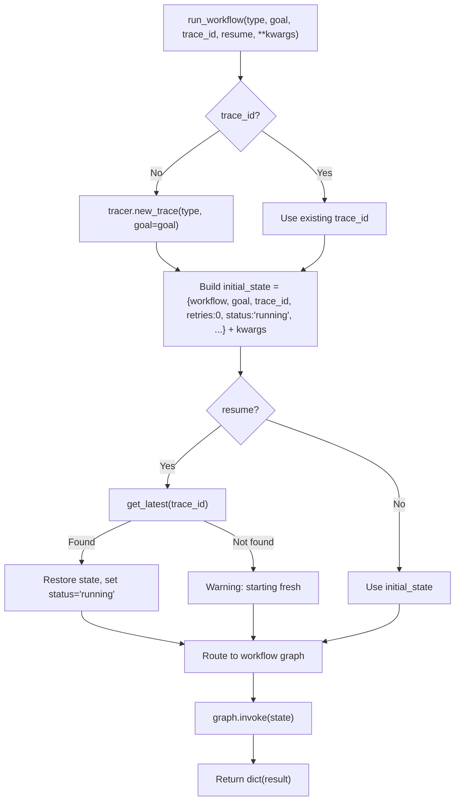

<- Back to [Base Overview](../BASE.md)

# 🏗️ Architecture

## 🔗 Source Code Reference

| File | Purpose |
|------|---------|
| `workflows/base.py` | Shared `WorkflowState`, `trim_state()`, `node_step()`, `node_error()`, `node_done()`, `run_workflow()` |
| `core/tracer.py` | `tracer.new_trace()` / `.step()` / `.error()` / `.finish()` / `.warning()` — observability |
| `core/config.py` | `cfg.*` — shared configuration |
| `core/memory_backend/eviction.py` | `eviction_queue.push()` — async memory eviction |
| `workflows/helpers/checkpoint.py` | `save_checkpoint()`, `get_latest()`, `mark_complete()` — checkpoint journal |
| `workflows/research.py` | `build_research_graph()` — research workflow |
| `workflows/data.py` | `build_data_graph()` — data workflow |
| `workflows/autocode.py` | `build_graph()` — autocode workflow |
| `workflows/deep_research_impl/graph.py` | `build_deep_research_graph()` — deep research workflow |
| `workflows/understand.py` | `run_understand_workflow_sync()` — understand workflow |
| `tests/workflows/base/test_base_nodes.py` | Node helper + dispatcher tests |

---

## 🌳 Module Tree

```text
workflows/base.py
├── WorkflowState (TypedDict)          # Shared state schema (22 fields)
├── trim_state(state)                  # Phase 5: Evict oversized fields to async queue
├── node_step(state, node, msg)        # Log a workflow step to the active trace
├── node_error(state, node, msg)     # Mark state as failed, log error, save checkpoint
├── node_done(state, result)           # Mark state as succeeded, finish trace, mark complete
└── run_workflow(type, goal, ...)      # Dispatcher: trace creation → checkpoint resume → graph.invoke()
```

---

## 🔀 Dispatch Flow



---

## 💡 Key Design Decisions

- **Partial update pattern** — `node_error()` and `node_done()` return `dict`s with only the changed keys (`status`, `error`, `result`, `artifacts`). This is LangGraph best practice — nodes should not return the full state.
- **Trace auto-creation** — If `trace_id` is empty, `tracer.new_trace()` creates one automatically. This means callers never need to manage trace IDs manually.
- **Checkpoint resumption** — `resume=True` attempts to restore from the checkpoint journal via `get_latest(trace_id)`. Version validation (`_checkpoint_version == 1`) prevents loading incompatible checkpoints.
- **Autocode compatibility** — `run_workflow()` converts `goal` → `task` for the autocode workflow. This bridges the `run_workflow()` API (which uses `goal`) with autocode's internal API (which uses `task`).
- **Understand special case** — The `understand` workflow is not a LangGraph StateGraph — it's a sync function (`run_understand_workflow_sync`). The dispatcher handles this specially by calling it directly instead of `graph.invoke()`.
- **Exception isolation** — The entire dispatch is wrapped in a try/except. If any workflow crashes, the error is logged to the trace and a clean failure dict is returned. Never leaks exceptions to the caller.
- **State trimming** — `trim_state()` evicts oversized fields (`search_results`, `output`, `analysis`) to the async eviction queue when they exceed ~1000 tokens. Prevents LangGraph checkpoint bloat.

---

## 🧪 Testing

```powershell
# Run base node tests
.\venv\Scripts\python tests/workflows/base/ -W error --tb=short -v
```

> **Note:** Ensure `pytest` resolves to your venv. If not, use `python -m pytest` or the full venv path (`venv\Scripts\pytest.exe` on Windows, `venv/bin/pytest` on Unix).

**Mock strategy:**
- Patch `core.tracer.tracer` for trace logging tests
- Patch `workflows.helpers.checkpoint.save_checkpoint` / `get_latest` / `mark_complete` for checkpoint tests
- Patch `core.memory_backend.eviction.eviction_queue.push` for trim_state tests
- Test `node_error` with empty message → fallback
- Test `node_done` with None artifacts → empty list
- Test `trim_state` with oversized fields → eviction
- Test `run_workflow` with unknown type → failed status
- Test `run_workflow` with `resume=True` and valid/invalid checkpoints
- Test `run_workflow` autocode compatibility — assert `task` key exists

**Current test layout:**
```text
tests/workflows/base/
└── test_base_nodes.py  # Node helper tests + dispatcher tests
```

> **Future:** When the module grows, split into `test_node_helpers.py`, `test_dispatcher.py`, `test_trim_state.py`, and add `conftest.py`.

---

*Last updated: 2026-07-04. See [API.md](API.md) for utility signatures and dispatcher details, [CHANGELOG.md](CHANGELOG.md) for version history, [INSTRUCTIONS.md](INSTRUCTIONS.md) for AI editing rules.*
