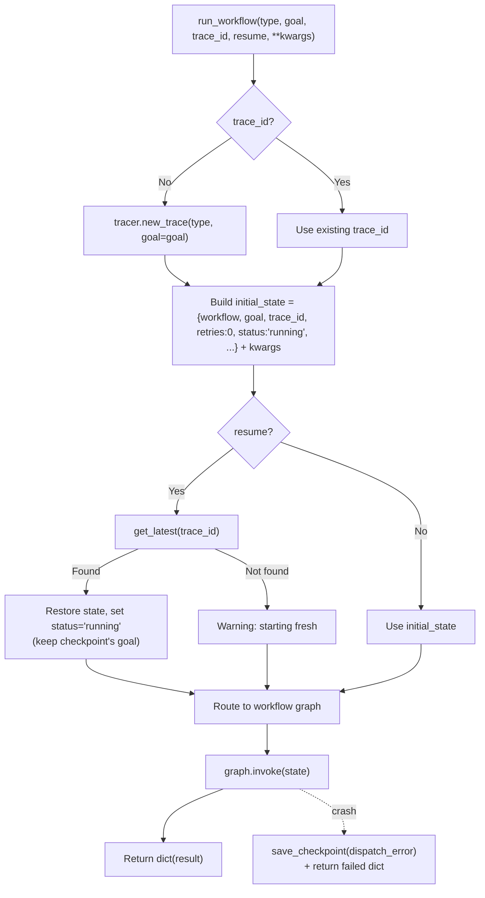

<- Back to [Base Overview](../BASE.md)

# 🏗️ Architecture

## 🔗 Source Code Reference

| File | Purpose |
|------|---------|
| `workflows/base.py` | Shared `WorkflowState`, `trim_state()`, `node_step()`, `node_error()`, `node_done()`, `run_workflow()` |
| `core/tracer.py` | `tracer.new_trace()` / `.step()` / `.error()` / `.finish()` / `.warning()` — observability (thin facade → `core/observability/tracer_engine.py`) |
| `core/config.py` | `cfg.*` — shared configuration |
| `core/memory_backend/eviction.py` | `eviction_queue.push()` — async memory eviction |
| `core/observability/checkpoint.py` | `save_checkpoint()`, `get_latest()`, `mark_complete()` — checkpoint journal (was `workflows/helpers/checkpoint.py` in v1.2; moved in v1.3) |
| `workflows/research.py` | `build_research_graph()` — research workflow |
| `workflows/data.py` | `build_data_graph()` — data workflow |
| `workflows/autocode.py` | `build_graph()` / `invoke_with_timeout()` — autocode workflow |
| `workflows/deep_research_impl/graph.py` | `build_deep_research_graph()` — deep research workflow |
| `workflows/understand.py` | `build_understand_graph()` / `_default_state()` — understand workflow |
| `tests/workflows/base/` | Per-concern test files + `conftest.py` |

---

## 🌳 Module Tree

```text
workflows/base.py
├── WorkflowState (TypedDict)          # Shared state schema (22 fields + task)
├── trim_state(state)                  # Phase 5: Evict oversized fields to async queue
├── node_step(state, node, msg)        # HELPER: Log a workflow step to the active trace (returns None)
├── node_error(state, node, msg)       # HELPER: Mark state as failed, log error, save FULL state checkpoint
├── node_done(state, result)           # HELPER: Mark state as succeeded, save success checkpoint, finish trace
└── run_workflow(type, goal, ...)      # Dispatcher: trace creation → checkpoint resume → graph.invoke()
```

---

## 🔀 Dispatch Flow



---

## 💡 Key Design Decisions

- **Partial update pattern** — `node_error()` and `node_done()` return `dict`s with only the changed keys (`status`, `error`, `result`, `artifacts`). This is LangGraph best practice — nodes should not return the full state.
- **Trace auto-creation** — If `trace_id` is empty, `tracer.new_trace()` creates one automatically. This means callers never need to manage trace IDs manually.
- **Checkpoint resumption** — `resume=True` attempts to restore from the checkpoint journal via `get_latest(trace_id)`. Version validation (`_checkpoint_version == 1`) prevents loading incompatible checkpoints.
- **Resume preserves original goal** — [v1.2] The checkpoint's original goal is kept on resume. Was: clobbered with the new `goal` parameter, making checkpoints meaningless if the caller passed a different goal.
- **Full state checkpoints** — [v1.2] `node_error()` saves the full workflow state (not just `{status, error}`), and `node_done()` saves a success checkpoint before `mark_complete()`. The exception handler also saves a checkpoint on crash. Resume from any of these has the complete workflow context.
- **Autocode compatibility** — `run_workflow()` converts `goal` → `task` for the autocode workflow. This bridges the `run_workflow()` API (which uses `goal`) with autocode's internal API (which uses `task`).
- **All workflows use `graph.invoke()`** — [v1.0] All six workflows (research, data, autocode, deep_research, understand) are sync LangGraph StateGraphs routed through `graph.invoke()`. No special-cased sync wrappers.
- **Exception isolation** — The entire dispatch is wrapped in a try/except. If any workflow crashes, a checkpoint is saved and a clean failure dict is returned. Never leaks exceptions to the caller.
- **State trimming** — `trim_state()` evicts oversized fields (`search_results`, `output`, `analysis`) to the async eviction queue when they exceed ~1000 tokens. Prevents LangGraph checkpoint bloat. v1.3: chonkie-aware — splits into sentence-aware chunks, evicts each individually (precise recall), keeps first chunk as preview. Falls back to whole-string eviction if chonkie is missing. **Note:** `trim_state()` is currently a utility — no workflow calls it yet (see CHANGELOG #18).

---

## 🧪 Testing

```bash
python -m pytest tests/workflows/base/ -v
```

**Test layout (per-concern, one concern per file):**
```text
tests/workflows/base/
├── conftest.py              # base_state fixture
├── test_node_helpers.py     # node_step (returns None, no mutation, tracer logging, checkpoint)
│                             # node_error (failed status, non-empty message, full state checkpoint)
│                             # node_done (success status, partial dict, success checkpoint)
├── test_dispatcher.py       # run_workflow routing, autocode compat, checkpoint resume, crash checkpoint
└── test_trim_state.py       # eviction threshold, new dict, preserves unchanged, non-string fields
```

---

*Last updated: 2026-07-06 (v1.2). See [API.md](API.md) for utility signatures and dispatcher details, [CHANGELOG.md](CHANGELOG.md) for version history, [INSTRUCTIONS.md](INSTRUCTIONS.md) for AI editing rules.*
