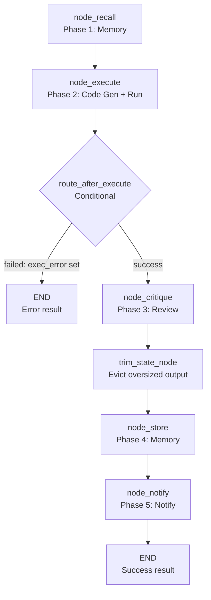

<- Back to [Data Overview](../DATA.md)

# 🏗️ Architecture

## 🔗 Source Code Reference

| File | Purpose |
|------|---------|
| `workflows/data.py` | Thin facade — re-exports `build_data_graph` + `WORKFLOW_METADATA` from `data_impl/` |
| `workflows/data_impl/graph.py` | `build_data_graph()` + `WORKFLOW_METADATA` (5-node LangGraph StateGraph) |
| `workflows/data_impl/routes.py` | `route_after_execute()` — conditional router (success → critique, failure → END) |
| `workflows/data_impl/helpers.py` | `_extract_code_from_response()` — code extraction with observable fallbacks |
| `workflows/data_impl/nodes/recall.py` | `node_recall` — memory recall (graceful on failure) |
| `workflows/data_impl/nodes/execute.py` | `node_execute` — code generation + sandboxed execution |
| `workflows/data_impl/nodes/critique.py` | `node_critique` — LLM critique of output quality |
| `workflows/data_impl/nodes/store.py` | `node_store` — episodic (+ procedural for generated code) storage |
| `workflows/data_impl/nodes/notify.py` | `node_notify` — user notification + `node_done` |
| `workflows/base.py` | `WorkflowState`, `node_step()`, `node_error()`, `node_done()` — shared infrastructure |
| `tools/agent.py` | `agent(action="dispatch", role="code"|"critique")` — code generation + critique |
| `tools/python.py` | `python(mode="run_data", code=...)` — sandboxed Python execution |
| `core/memory_engine.py` | `memory.recall()`, `memory.store_episodic()`, `memory.store_procedural()` |
| `tools/notify.py` | `notify(action="send", ...)` — user notification |
| `tests/workflows/data/` | Per-node test files + `conftest.py` + `TestSubpackageStructure` |

---

## 🌳 Module Tree

```text
workflows/data.py                        # Thin facade — re-exports build_data_graph + WORKFLOW_METADATA
workflows/data_impl/
├── graph.py                             # build_data_graph() + WORKFLOW_METADATA
├── routes.py                            # route_after_execute()  (route_after_critique removed — dead code)
├── helpers.py                           # _extract_code_from_response() — patch → fence → raw text
└── nodes/
    ├── recall.py                        # node_recall — memory recall (try/except, non-fatal)
    ├── execute.py                       # node_execute — code gen + run; sets exec_error + code_generated
    ├── critique.py                      # node_critique — uses context= (not content=); logs failures
    ├── store.py                         # node_store — procedural only for LLM-generated code
    └── notify.py                        # node_notify — notify() wrapped; always reaches node_done
```

> **No `state.py`.** `data` reuses `WorkflowState` from `workflows/base.py` (same as `research_impl`) — every data field (`goal`, `code`, `memory_context`, `output`, `exec_error`, `result`, `status`, `trace_id`) already exists there. The only data-internal state key is `code_generated` (set by `node_execute`, read by `node_store`); it flows as a plain dict key.

---

## 🔀 Dispatch Flow



**Conditional edge:** `route_after_execute` checks `state["exec_error"]`. Both failure paths in `node_execute` (code-gen failure and execution failure) now set `exec_error`, so failures route to END. Previously code-gen failure returned `node_error()` (which sets `status:failed` but not `exec_error`), so it leaked through to critique.

---

## 💡 Key Design Decisions (v1.0)

- **Sync nodes, partial dicts** — All nodes are `def` (sync) and return partial update dicts (only changed keys), not `{**state, ...}`. This is the LangGraph best practice and matches `research_impl`.
- **Reuses `WorkflowState`** — No custom `DataState`; data's fields already live in the shared `WorkflowState`. Same decision as `research_impl`.
- **`code_generated` flag** — `node_execute` sets `code_generated: bool` so `node_store` only stores procedural memory for LLM-generated code, not user-provided code. Flows as a plain dict key (not in the TypedDict).
- **Memory-first** — `node_recall` runs before code generation to provide relevant past analyses as context.
- **Single-pass execution** — No retry loop. Code-gen failure → END. Execution failure → END. Critique reviews but does not retry.
- **Non-fatal memory/notify** — `memory.recall`, `memory.store_*`, and `notify()` are wrapped in `try/except` + `tracer.error`. A memory or notification hiccup never crashes the workflow or flips a successful analysis to failed.
- **Observable code extraction** — `_extract_code_from_response` logs each fallback (`patch` → ```python``` fence → raw text) via `tracer.warning`, so a malformed LLM response is debuggable instead of silently producing broken code.
- **`context=` for text** — `node_critique` passes the code output via `context=` (text channel), not `content=` (base64 image channel).

---

## 🧪 Testing

```bash
python -m pytest tests/workflows/data/ -v
```

**Test layout (v1.0 split — one concern per file):**
```text
tests/workflows/data/
├── conftest.py          # base_state fixture
├── test_graph.py        # topology + WORKFLOW_METADATA + TestSubpackageStructure
├── test_routes.py       # route_after_execute (both paths) + route_after_critique removed
├── test_helpers.py      # _extract_code_from_response (patch/fence/raw-text)
├── test_recall.py       # memory recall + graceful failure
├── test_execute.py      # code gen + execution + failure routing + code_generated
├── test_critique.py     # context= usage + empty-output skip + failure logging
├── test_store.py        # episodic + procedural gating on code_generated
└── test_notify.py       # notify(action='send') + graceful notify failure
```

**Mock strategy (patch at the SOURCE module — tools are imported inside nodes):**
- `patch("tools.agent.agent")` — code generation + critique
- `patch("tools.python.python")` — sandboxed execution
- `patch("core.memory_engine.memory")` — recall + store
- `patch("tools.notify.notify")` — notification

**`TestSubpackageStructure`** verifies the audit fixes are present in source (via `ast`-based comment/docstring stripping): `context=` not `content=`, `tracer.error` on critique/notify failure, `code_generated` gating, no inline `import re`, `exec_error` set on failure, and `route_after_critique` removed.

---

*Last updated: 2026-07-13 (v1.1.1). See [API.md](API.md) for node details, [CHANGELOG.md](CHANGELOG.md) for version history, [INSTRUCTIONS.md](INSTRUCTIONS.md) for AI editing rules.*
