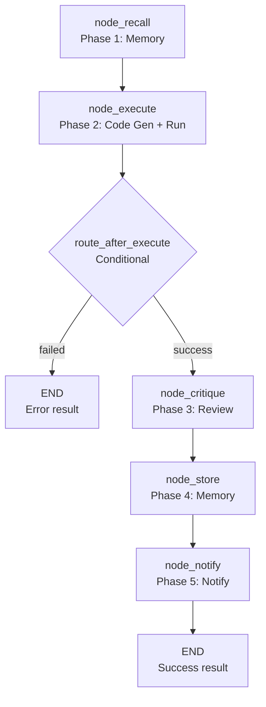

<- Back to [Data Overview](../DATA.md)

# 🏗️ Architecture

## 🔗 Source Code Reference

| File | Purpose |
|------|---------|
| `workflows/data.py` | `build_data_graph()` — 5-node LangGraph StateGraph for data analysis |
| `workflows/base.py` | `WorkflowState`, `node_step()`, `node_error()`, `node_done()` — shared infrastructure |
| `tools/agent.py` | `agent(action="dispatch", role="code")` — code generation |
| `tools/agent.py` | `agent(action="dispatch", role="critique")` — critique review |
| `tools/python.py` | `python(code=...)` — sandboxed Python execution |
| `tools/memory.py` | `memory.recall()`, `memory.store_semantic()`, `memory.store_procedural()` — memory operations |
| `tools/notify.py` | `notify(action="notify", message=...)` — user notification |
| `core/config.py` | `cfg.code_timeout`, `cfg.critique_timeout`, `cfg.python_timeout` — timeouts |
| `core/utils.py` | `compress_result()` — result compression |
| `tests/workflows/data/test_data_flow.py` | Full workflow test |

---

## 🌳 Module Tree

```text
workflows/data.py
├── build_data_graph()              # 5-node LangGraph StateGraph
│   ├── node_recall()               # Phase 1: Memory recall
│   ├── node_execute()              # Phase 2: Code generation + execution
│   ├── route_after_execute()       # Conditional: failed → END, success → critique
│   ├── node_critique()             # Phase 3: Review + critique
│   ├── node_store()                # Phase 4: Store results in memory
│   └── node_notify()               # Phase 5: Notify user
```

---

## 🔀 Dispatch Flow



---

## 💡 Key Design Decisions

- **Memory first** — `node_recall` runs before code generation to provide relevant past analyses as context. This improves the quality of generated code.
- **Single-pass execution** — The workflow does not loop on execution failure. If code generation fails, the workflow ends with an error. If execution fails, the error is captured but the workflow still proceeds to critique (not retry).
- **Critique as review, not retry** — `node_critique` reviews the output and provides feedback. It does not generate a fix or retry execution. The critique is stored in memory for future reference.
- **Procedural memory** — If code was generated and execution succeeded, the code is stored in procedural memory. This enables future recall of similar analyses.
- **No JSON parsing** — The code role outputs raw Python code, not JSON. The workflow extracts code from markdown fences using regex.
- **Result compression** — The execution output is compressed via `compress_result()` before being returned. This prevents oversized responses.

---

## 🧪 Testing

```powershell
# Run data workflow tests
.\venv\Scripts\python tests/workflows/data/ -W error --tb=short -v
```

> **Note:** Ensure `pytest` resolves to your venv. If not, use `python -m pytest` or the full venv path (`venv\Scripts\pytest.exe` on Windows, `venv/bin/pytest` on Unix).

**Mock strategy:**
- Patch `agent(action="dispatch", role="code")` for code generation
- Patch `python(code=...)` for execution
- Patch `agent(action="dispatch", role="critique")` for critique
- Patch `memory.recall()` and `memory.store_*` for memory operations
- Patch `notify(action="notify")` for notification
- Test `node_execute` with code extraction failure → assert error state
- Test `route_after_execute` with `exec_error` → assert `"failed"`
- Test `route_after_execute` without `exec_error` → assert `"critique"`
- Test `node_store` with user-provided code → assert procedural memory NOT stored

**Current test layout:**
```text
tests/workflows/data/
└── test_data_flow.py  # Full workflow test
```

> **Future:** Split into per-node files: `test_node_recall.py`, `test_node_execute.py`, `test_node_critique.py`, `test_node_store.py`, `test_node_notify.py`, plus `conftest.py`.

---

*Last updated: 2026-07-04. See [API.md](API.md) for node details, [CHANGELOG.md](CHANGELOG.md) for version history, [INSTRUCTIONS.md](INSTRUCTIONS.md) for AI editing rules.*
