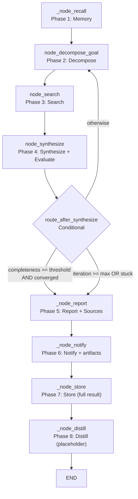

<- Back to [Deep Research Overview](../DEEP_RESEARCH.md)

# 🏗️ Architecture

## 🔗 Source Code Reference

| File | Purpose |
|------|---------|
| `workflows/deep_research.py` | `run_deep_research_agent()` — sync facade with timeout enforcement |
| `workflows/deep_research_impl/graph.py` | `build_deep_research_graph()` + `WORKFLOW_METADATA` — 8-node cyclic LangGraph |
| `workflows/deep_research_impl/state.py` | `DeepResearchState` — extended TypedDict with budget + knowledge fields |
| `workflows/deep_research_impl/routes.py` | `route_after_synthesize()` — conditional routing (loop or exit) |
| `workflows/deep_research_impl/budget.py` | `decrement_api_calls()`, `decrement_browser_actions()`, `log_event()` — budget tracking |
| `workflows/deep_research_impl/constants.py` | Prompts + `CONVERGENCE_SIMILARITY_THRESHOLD` + `_is_converged()` |
| `workflows/deep_research_impl/nodes/decompose.py` | `node_decompose_goal()` — planner LLM goal decomposition |
| `workflows/deep_research_impl/nodes/search.py` | `node_search()` — multi-tool search (Tavily → web → browser) |
| `workflows/deep_research_impl/nodes/synthesize.py` | `node_synthesize()` — synthesis + evaluation + convergence |
| `core/citations.py` | `citations.add()` / `get_sources()` — per-trace source tracker (wired in v1.1) |
| `workflows/base.py` | `WorkflowState`, `run_workflow()` — shared infrastructure |
| `tests/workflows/deep_research/` | Per-concern test files + `conftest.py` (see Testing section below) |

---

## 🌳 Module Tree

```text
workflows/deep_research.py
├── run_deep_research_agent()         # Sync facade with timeout enforcement
│   └── run_workflow()                # Dispatcher → graph.invoke()

workflows/deep_research_impl/
├── graph.py                          # build_deep_research_graph() + WORKFLOW_METADATA
│   ├── _node_recall()                # Phase 1: Memory recall (logs failures v1.1)
│   ├── _node_report()                # Phase 5: Report + sources appendix (v1.1)
│   ├── _node_notify()                # Phase 6: Notify + artifacts=source URLs (v1.1)
│   ├── _node_store()                 # Phase 7: Memory storage (full result v1.1)
│   └── _node_distill()               # Phase 8: Distillation (placeholder)
├── state.py                          # DeepResearchState TypedDict (+ synthesis field v1.1)
├── routes.py                         # route_after_synthesize()
├── budget.py                         # Budget tracking (pure functions, partial dicts)
├── constants.py                      # Prompts + convergence threshold
└── nodes/
    ├── decompose.py                  # Goal decomposition (planner LLM)
    ├── search.py                     # Multi-tool search (Tavily budget on attempt v1.1)
    └── synthesize.py                 # Synthesis + evaluation (task/context fixed v1.1)
```

---

## 🔀 Dispatch Flow



**Exit conditions (checked in order by `route_after_synthesize`):**
1. Hard cap: `iteration >= max_iterations` → report
2. Stuck-loop: `consecutive_empty_iterations >= 2` → report
3. Dual-gate: `completeness >= threshold AND converged` → report
4. Otherwise → decompose (continue loop)

---

## 💡 Key Design Decisions

- **Cyclic workflow** — Loops between search and synthesis until convergence or budget exhaustion. The core innovation of deep research.
- **Convergence detection** — Uses `difflib.SequenceMatcher` similarity between previous and current knowledge base. If similarity ≥ `CONVERGENCE_SIMILARITY_THRESHOLD` (0.85), the workflow converges.
- **Budget tracking** — API calls (Tavily, paid) and browser actions tracked separately. **v1.1:** Tavily budget decrements on ATTEMPT (paid API charges per call regardless of outcome); web (SearXNG) is free and never decrements.
- **Multi-tool search** — Three-tier: Tavily API → web search → browser fallback. Each tier has different cost and coverage.
- **Citations (v1.1)** — `node_search` registers sources via `citations.add()`; `_node_report` appends a `## Sources` section; `_node_notify` returns source URLs as `artifacts`. Mirrors the research workflow.
- **`WORKFLOW_METADATA` (v1.1)** — Structured dict (nodes + edges with conditions) for MCP client introspection. Mirrors research/understand/data.
- **Partial-dict returns (v1.1)** — All `_node_*` helpers return only changed keys (LangGraph best practice), not `{**state, ...}`.
- **Non-fatal memory/notify (v1.1)** — `memory.recall`, `memory.store_*`, and `notify()` are wrapped in `try/except` + `tracer.error`. Failures never crash the workflow.

---

## 🧪 Testing

```bash
python -m pytest tests/workflows/deep_research/ -v
```

**Test layout (per-concern, one concern per file):**
```text
tests/workflows/deep_research/
├── conftest.py          # base_state fixture (DeepResearchState defaults)
├── test_graph.py        # topology + WORKFLOW_METADATA + partial dicts + facade + timeout
├── test_routes.py       # route_after_synthesize (all 4 exit conditions)
├── test_recall.py       # _node_recall + graceful failure + tracer.error
├── test_report.py       # _node_report + citations appendix
├── test_notify.py       # _node_notify + source URLs as artifacts
├── test_store.py        # _node_store + full-text (no 800 truncation)
├── test_decompose.py    # node_decompose_goal + _parse_sub_queries
├── test_search.py       # tool selection + fallback + evidence + seen_urls dedup + budget
├── test_synthesize.py   # synthesis + evaluation + task/context mapping (P0 #2)
└── test_budget.py       # budget tracking utilities
```

**Mock strategy (patch at the SOURCE module — tools are imported inside nodes):**
- `patch("workflows.deep_research_impl.nodes.decompose.llm.complete")` — decomposition
- `patch("workflows.deep_research_impl.nodes.synthesize.agent")` — synthesis + evaluation
- `patch("workflows.deep_research_impl.nodes.search.tavily" / ".web" / ".browser")` — search
- `patch("workflows.deep_research_impl.graph.memory.recall" / ".store_semantic" / ".store_episodic")` — memory
- `patch("workflows.deep_research_impl.graph.notify")` — notification
- `patch("core.citations.citations.get_sources")` — citations in report/notify

---

*Last updated: 2026-07-06 (test suite reorganization). See [API.md](API.md) for node details, [CHANGELOG.md](CHANGELOG.md) for version history, [INSTRUCTIONS.md](INSTRUCTIONS.md) for AI editing rules.*
