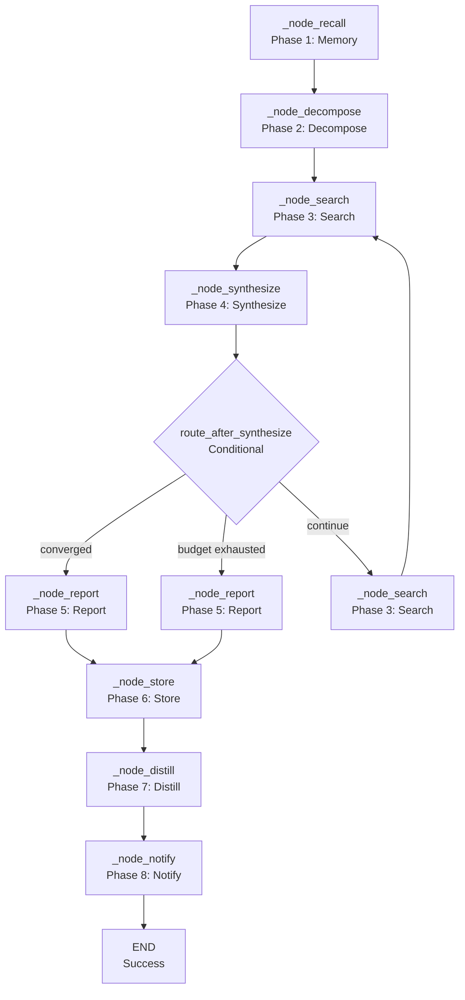

<- Back to [Deep Research Overview](../DEEP_RESEARCH.md)

# 🏗️ Architecture

## 🔗 Source Code Reference

| File | Purpose |
|------|---------|
| `workflows/deep_research.py` | `run_deep_research()` — sync facade with ThreadPoolExecutor |
| `workflows/deep_research_impl/graph.py` | `build_deep_research_graph()` — 8-node LangGraph StateGraph |
| `workflows/deep_research_impl/state.py` | `DeepResearchState` — extended TypedDict with budget fields |
| `workflows/deep_research_impl/routes.py` | `route_after_synthesize()` — conditional routing logic |
| `workflows/deep_research_impl/budget.py` | `decrement_api_calls()`, `decrement_browser_actions()`, `is_budget_exhausted()` — budget tracking |
| `workflows/deep_research_impl/constants.py` | `SYNTHESIZE_SYSTEM_PROMPT`, `EVALUATE_SYSTEM_PROMPT`, `CONVERGENCE_SIMILARITY_THRESHOLD` — shared constants |
| `workflows/deep_research_impl/nodes/decompose.py` | `node_decompose_goal()` — goal decomposition |
| `workflows/deep_research_impl/nodes/search.py` | `node_search()` — multi-tool search |
| `workflows/deep_research_impl/nodes/synthesize.py` | `node_synthesize()` — synthesis + evaluation |
| `workflows/base.py` | `WorkflowState`, `node_step()`, `node_error()`, `node_done()` — shared infrastructure |
| `tools/agent.py` | `agent(action="dispatch", role="research")` — synthesis |
| `tools/agent.py` | `agent(action="dispatch", role="executor")` — evaluation |
| `tools/web.py` | `web(action="search", query=...)` — web search |
| `tools/web.py` | `web(action="read", url=...)` — web scraping |
| `tools/browser.py` | `browser(action="navigate", url=...)` — browser fallback |
| `tools/memory.py` | `memory.recall()`, `memory.store_semantic()` — memory operations |
| `tools/notify.py` | `notify(action="notify", message=...)` — user notification |
| `tools/report.py` | `report(action="report", title=...)` — report generation |
| `core/config.py` | `cfg.deep_research_max_api_calls`, `cfg.deep_research_max_browser_actions`, `cfg.deep_research_convergence_threshold` — config |
| `tests/workflows/deep_research/test_deep_research.py` | Full workflow test |

---

## 🌳 Module Tree

```text
workflows/deep_research.py
├── run_deep_research()               # Sync facade (entry point)
│   ├── ThreadPoolExecutor(max_workers=1)
│   └── run_workflow()                # Dispatcher

workflows/deep_research_impl/
├── graph.py                          # LangGraph builder
│   ├── _node_recall()                # Phase 1: Memory recall
│   ├── _node_decompose()             # Phase 2: Goal decomposition
│   ├── _node_search()                # Phase 3: Multi-tool search
│   ├── _node_synthesize()            # Phase 4: Synthesis + evaluation
│   ├── _node_report()                # Phase 5: Report generation
│   ├── _node_store()                 # Phase 6: Memory storage
│   ├── _node_distill()               # Phase 7: Distillation (placeholder)
│   └── _node_notify()                # Phase 8: Notify user
├── state.py                          # DeepResearchState TypedDict
├── routes.py                         # Conditional routing logic
├── budget.py                         # Budget tracking and audit
├── constants.py                      # Shared constants and prompts
└── nodes/
    ├── decompose.py                  # Goal decomposition logic
    ├── search.py                     # Multi-tool search logic
    └── synthesize.py               # Synthesis + evaluation logic
```

---

## 🔀 Dispatch Flow



---

## 💡 Key Design Decisions

- **Cyclic workflow** — The workflow loops between search and synthesis until convergence or budget exhaustion. This is the core innovation of deep research.
- **Convergence detection** — Uses cosine similarity between the previous and current knowledge base. If similarity exceeds `CONVERGENCE_SIMILARITY_THRESHOLD` (0.85), the workflow converges.
- **Budget tracking** — Tracks API calls (Tavily) and browser actions separately. Prevents runaway costs.
- **Multi-tool search** — Three-tier tool selection: Tavily API → web search → browser fallback. Each tier has different cost and coverage characteristics.
- **Goal decomposition** — The planner LLM breaks the goal into sub-queries for parallel search. This improves coverage.
- **Evaluation** — The executor LLM evaluates the synthesis quality and completeness. This provides a stopping criterion.
- **Memory recall** — Recalls past research for context. This prevents redundant research.
- **Report generation** — Generates a structured report with the final synthesis, sources, and metadata.

---

## 🧪 Testing

```powershell
# Run deep research tests
.\venv\Scripts\python tests/workflows/deep_research/ -W error --tb=short -v
```

> **Note:** Ensure `pytest` resolves to your venv. If not, use `python -m pytest` or the full venv path (`venv\Scripts\pytest.exe` on Windows, `venv/bin/pytest` on Unix).

**Mock strategy:**
- Patch `llm.complete(role="planner")` for decomposition
- Patch `agent(action="dispatch", role="research")` for synthesis
- Patch `agent(action="dispatch", role="executor")` for evaluation
- Patch `web(action="search")` and `web(action="read")` for search
- Patch `browser(action="navigate")` and `browser(action="text_content")` for browser fallback
- Patch `memory.recall()` and `memory.store_semantic()` for memory operations
- Patch `report(action="report")` for report generation
- Patch `notify(action="notify")` for notification
- Test convergence detection with similar knowledge bases → assert `"converged"` route
- Test budget exhaustion → assert `"budget_exhausted"` route
- Test `node_search` with Tavily failure → assert web fallback
- Test `node_search` with browser fallback → assert text extraction

**Current test layout:**
```text
tests/workflows/deep_research/
└── test_deep_research.py  # Full workflow test
```

> **Future:** Split into per-node files: `test_node_recall.py`, `test_node_decompose.py`, `test_node_search.py`, `test_node_synthesize.py`, `test_node_report.py`, `test_node_store.py`, `test_node_distill.py`, `test_node_notify.py`, plus `conftest.py`.

---

*Last updated: 2026-07-04. See [API.md](API.md) for node details, [CHANGELOG.md](CHANGELOG.md) for version history, [INSTRUCTIONS.md](INSTRUCTIONS.md) for AI editing rules.*
