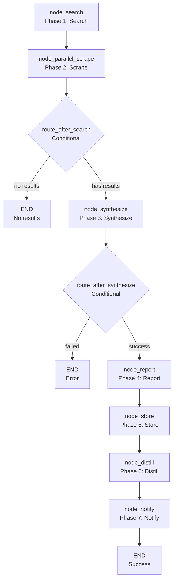

<- Back to [Research Overview](../RESEARCH.md)

# 🏗️ Architecture

## 🔗 Source Code Reference

| File | Purpose |
|------|---------|
| `workflows/research.py` | `build_research_graph()` — 8-node LangGraph StateGraph for web research |
| `workflows/base.py` | `WorkflowState`, `node_step()`, `node_error()`, `node_done()` — shared infrastructure |
| `tools/agent.py` | `agent(action="dispatch", role="research")` — synthesis |
| `tools/agent.py` | `agent(action="dispatch", role="extract")` — distillation |
| `tools/web.py` | `web(action="search", query=...)` — web search |
| `tools/web.py` | `web(action="read", url=...)` — web scraping |
| `tools/memory.py` | `memory.store_semantic()`, `memory.store_procedural()` — memory operations |
| `tools/notify.py` | `notify(action="notify", message=...)` — user notification |
| `tools/report.py` | `report(action="report", title=...)` — report generation |
| `core/config.py` | `cfg.web_max_search_results`, `cfg.worker_timeout`, `cfg.research_timeout` — timeouts |
| `core/utils.py` | `compress_result()` — result compression |
| `tests/workflows/research/test_research_flow.py` | Full workflow test |

---

## 🌳 Module Tree

```text
workflows/research.py
├── build_research_graph()              # 8-node LangGraph StateGraph
│   ├── node_search()                   # Phase 1: Web search
│   ├── node_parallel_scrape()          # Phase 2: Parallel scraping
│   ├── route_after_search()            # Conditional: no results → END
│   ├── node_synthesize()               # Phase 3: LLM synthesis
│   ├── route_after_synthesize()        # Conditional: failed → END
│   ├── node_report()                   # Phase 4: Generate report
│   ├── node_store()                    # Phase 5: Store in memory
│   ├── node_distill()                  # Phase 6: Distill to procedural memory
│   └── node_notify()                   # Phase 7: Notify user
```

---

## 🔀 Dispatch Flow



---

## 💡 Key Design Decisions

- **Parallel scraping** — Uses `ThreadPoolExecutor` with `max_workers=3` to scrape up to 3 sources concurrently. This reduces latency significantly compared to sequential scraping.
- **Timeout handling** — Each scrape has a 30-second timeout (web tool) + 30-second LLM summarization timeout. Total per-source timeout is 60 seconds.
- **Deduplication** — `seen_urls` prevents scraping the same URL twice across iterations.
- **Citation tracking** — The `citations` module tracks sources per trace_id. This enables attribution in the final report.
- **Memory storage** — The synthesized result is stored in semantic memory. The `node_distill` step extracts procedural knowledge (e.g., "how to research X") for future recall.
- **Report generation** — The `node_report` step generates a structured report with the synthesis, sources, and metadata.
- **No JSON parsing** — The synthesis role outputs markdown, not JSON. The workflow handles raw text.
- **Result compression** — The final result is compressed via `compress_result()` before being returned.

---

## 🧪 Testing

```powershell
# Run research workflow tests
.\venv\Scripts\python tests/workflows/research/ -W error --tb=short -v
```

> **Note:** Ensure `pytest` resolves to your venv. If not, use `python -m pytest` or the full venv path (`venv\Scripts\pytest.exe` on Windows, `venv/bin/pytest` on Unix).

**Mock strategy:**
- Patch `web(action="search")` for search results
- Patch `web(action="read")` for scrape results
- Patch `agent(action="dispatch", role="research")` for synthesis
- Patch `agent(action="dispatch", role="extract")` for distillation
- Patch `memory.store_semantic()` and `memory.store_procedural()` for memory storage
- Patch `notify(action="notify")` for notification
- Test `node_search` with empty results → assert `"no_results"` route
- Test `node_parallel_scrape` with timeout → assert graceful handling
- Test `node_synthesize` with `agent()` failure → assert error state
- Test `route_after_synthesize` with `"failed"` status → assert `"failed"` route

**Current test layout:**
```text
tests/workflows/research/
└── test_research_flow.py  # Full workflow test
```

> **Future:** Split into per-node files: `test_node_search.py`, `test_node_scrape.py`, `test_node_synthesize.py`, `test_node_report.py`, `test_node_store.py`, `test_node_distill.py`, `test_node_notify.py`, plus `conftest.py`.

---

*Last updated: 2026-07-04. See [API.md](API.md) for node details, [CHANGELOG.md](CHANGELOG.md) for version history, [INSTRUCTIONS.md](INSTRUCTIONS.md) for AI editing rules.*
