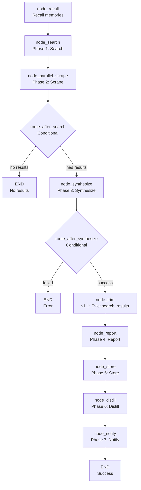

<- Back to [Research Overview](../RESEARCH.md)

# 🏗️ Architecture

## 🔗 Source Code Reference

| File | Purpose |
|------|---------|
| `workflows/research.py` | Thin facade — re-exports `build_research_graph`, `WORKFLOW_METADATA` (v1.0) |
| `workflows/research_impl/graph.py` | `build_research_graph()` + `WORKFLOW_METADATA` — 9-node LangGraph StateGraph (v1.1: +trim node) |
| `workflows/research_impl/routes.py` | `route_after_search()`, `route_after_synthesize()` — conditional routers |
| `workflows/research_impl/helpers.py` | `_scrape_and_summarize()`, `_browser_fallback_scrape()`, `_is_nested_parallel()` |
| `workflows/research_impl/nodes/recall.py` | `node_recall()` — recall memories from ChromaDB |
| `workflows/research_impl/nodes/search.py` | `node_search()` — SearXNG web search (deduplicated, v1.0: uses `cfg.web_max_search_results`) |
| `workflows/research_impl/nodes/parallel_scrape.py` | `node_parallel_scrape()` — parallel scraping with browser fallback (v1.0: `wait()` + cancel) |
| `workflows/research_impl/nodes/synthesize.py` | `node_synthesize()` — LLM synthesis via `agent(action="dispatch", role="research")` |
| `workflows/base.py` | `trim_state_node()` (v1.1: wired between synthesize and report) |
| `workflows/research_impl/nodes/report.py` | `node_report()` — generate cited research dossier |
| `workflows/research_impl/nodes/store.py` | `node_store()` — store in semantic + episodic memory (v1.0: full result, not `[:800]`) |
| `workflows/research_impl/nodes/distill.py` | `node_distill()` — distill procedural rules (v1.0: dead status check removed) |
| `workflows/research_impl/nodes/notify.py` | `node_notify()` — notify user + `node_done()` (v1.0: artifacts as `list[str]`) |
| `workflows/base.py` | `WorkflowState`, `node_step()`, `node_error()`, `node_done()`, `trim_state_node()` — shared infrastructure |
| `tools/agent.py` | `agent(action="dispatch", role="research")` — synthesis |
| `tools/agent.py` | `agent(action="dispatch", role="extract")` — distillation |
| `tools/web.py` | `web(action="search", query=...)` — web search |
| `tools/web.py` | `web(action="read", url=...)` — web scraping |
| `tools/memory.py` | `memory.store_semantic()`, `memory.store_procedural()` — memory operations |
| `tools/notify.py` | `notify(action="notify", message=...)` — user notification |
| `tools/report.py` | `report(action="report", title=...)` — report generation |
| `core/config.py` | `cfg.web_max_search_results`, `cfg.worker_timeout`, `cfg.research_timeout` — timeouts |
| `core/utils.py` | `compress_result()` — result compression |

---

## 🌳 Module Tree

```text
workflows/research.py              # Thin facade (v1.0) — re-exports build_research_graph, WORKFLOW_METADATA
workflows/research_impl/
├── __init__.py
├── graph.py                       # build_research_graph() + WORKFLOW_METADATA (v1.1: 9 nodes)
├── routes.py                      # route_after_search(), route_after_synthesize()
├── helpers.py                     # _scrape_and_summarize(), _browser_fallback_scrape(), _is_nested_parallel()
└── nodes/
    ├── __init__.py
    ├── recall.py                  # node_recall() — recall memories
    ├── search.py                  # node_search() — web search (deduplicated)
    ├── parallel_scrape.py         # node_parallel_scrape() — parallel scraping (v1.0: wait + cancel)
    ├── synthesize.py              # node_synthesize() — LLM synthesis
    ├── report.py                  # node_report() — generate dossier
    ├── store.py                   # node_store() — store in memory (v1.0: full result)
    ├── distill.py                 # node_distill() — distill procedural rules
    └── notify.py                  # node_notify() — notify + node_done (v1.0: artifacts as list[str])
```

---

## 🔀 Dispatch Flow



---

## 💡 Key Design Decisions

- **Subpackage split (v1.0)** — Monolithic `workflows/research.py` (513 lines) split into `research_impl/` subpackage with per-node modules. Same pattern as `autocode_impl/` and `deep_research_impl/`. Thin facade in `workflows/research.py` re-exports `build_research_graph` and `WORKFLOW_METADATA` for backward compatibility.
- **Parallel scraping** — Uses `ThreadPoolExecutor` with `max_workers=3` to scrape up to 3 sources concurrently. This reduces latency significantly compared to sequential scraping.
- **Timeout handling (v1.0 fix)** — Uses `concurrent.futures.wait(timeout=)` for global timeout (was `as_completed(timeout=)` which only timed out the first future). Pending futures are `.cancel()`ed on timeout to prevent zombie threads.
- **Deduplication** — `seen_urls` prevents scraping the same URL twice. v1.0 also added URL deduplication in `node_search` (was only in `parallel_scrape`).
- **Citation tracking** — The `citations` module tracks sources per trace_id. This enables attribution in the final report.
- **Memory storage (v1.0 fix)** — The synthesized result is stored in FULL in semantic memory (was `result[:800]` — truncated, nearly useless). Episodic memory stores a short summary.
- **Trim node (v1.1)** — `trim_state_node` between synthesize and report. After synthesize produces `result`, the raw `search_results` (up to 40KB) is evicted to episodic memory. Chonkie-aware: splits into chunks, evicts each individually, keeps first chunk as preview. Falls back to whole-string eviction if chonkie missing. Safe because report/store/distill/notify all use `result`, not `search_results`.
- **Report generation** — The `node_report` step generates a structured report with the synthesis, sources, and metadata.
- **No JSON parsing** — The synthesis role outputs markdown, not JSON. The workflow handles raw text.
- **Result compression** — The final result is compressed via `compress_result()` before being returned.

---

## 🧪 Testing

```powershell
# Run research workflow tests
.\venv\Scripts\python tests/workflows/research/ -W error --tb=short -v
```

> **Note:** Ensure `pytest` resolves to your venv. If not, use `python -m pytest` or the full venv path (`venv\Scripts\pytest.exe` on Windows, `venv/bin/pytest` on Unix).

**Mock strategy:**
- Patch `web(action="search")` for search results
- Patch `web(action="read")` for scrape results
- Patch `agent(action="dispatch", role="research")` for synthesis
- Patch `agent(action="dispatch", role="extract")` for distillation
- Patch `memory.store_semantic()` and `memory.store_procedural()` for memory storage
- Patch `notify(action="notify")` for notification
- Test `node_search` with empty results → assert `"no_results"` route
- Test `node_parallel_scrape` with timeout → assert graceful handling
- Test `node_synthesize` with `agent()` failure → assert error state
- Test `route_after_synthesize` with `"failed"` status → assert `"failed"` route

**Test layout (v1.0 restructure):**
```text
tests/workflows/research/
├── conftest.py                    # Shared fixtures: base_state
├── test_graph.py                  # Graph topology, WORKFLOW_METADATA, subpackage structure (11 structural tests)
├── test_routes.py                 # route_after_search, route_after_synthesize
├── test_search.py                 # node_search (dedup, max_results)
├── test_parallel_scrape.py        # node_parallel_scrape (wait vs as_completed, cancel, browser fallback)
├── test_synthesize.py             # node_synthesize (action="dispatch", status check)
├── test_report.py                 # node_report
└── test_trim_integration.py       # v1.1: trim node integration (field safety, chonkie/fallback paths)
```

---

*Last updated: 2026-07-14 (v1.1.1). See [API.md](API.md) for node details, [CHANGELOG.md](CHANGELOG.md) for version history, [INSTRUCTIONS.md](INSTRUCTIONS.md) for AI editing rules.*
