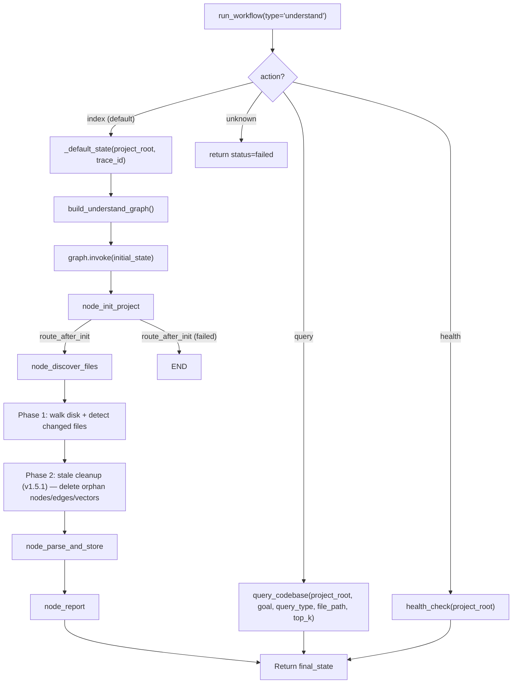

<- Back to [Understand Overview](../UNDERSTAND.md)

# 🏗️ Architecture

## 🔗 Source Code Reference

| File | Purpose |
|------|---------|
| `workflows/understand.py` | Thin facade — re-exports from understand_impl + `run_understand_workflow_sync()`. [v1.4.1] Lazy `is_same_path` import; `project_path` validation; normalized return shape. [v1.5] `action` parameter routes to query/health; re-exports `query_codebase` + `health_check` from `understand_impl.query` (was `understand_query` — moved in v1.5.1). |
| `workflows/understand_impl/query.py` | [v1.5] NEW — `query_codebase()` (semantic/keyword/dependencies/callers) + `health_check()` (index stats). Bypasses the indexing graph entirely. [v1.5.1] MOVED here from `workflows/understand_query.py` (matches the `<workflow>_impl/` pattern). |
| `core/kgraph/project.py` | `ProjectManager` — project resolution, indexing mode, artifact paths. [v1.4.1] `SKIP_DIRS` class constant (canonical single source of truth). |
| `core/kgraph/storage.py` | `GraphStore` — thread-safe SQLite graph store with WAL mode. [v1.5.1] +`get_all_file_paths()` + `delete_file_entry()` for stale cleanup. |
| `core/kgraph/ast_parser.py` | `_parse_dependencies_sync_from_string()` — delegates to tree-sitter (Python) |
| `core/kgraph/tree_sitter_parser.py` | [#4] Multi-language parser: Python, JS/TS, Go, Rust + 9 more via tree-sitter. [v1.4.1] Optional `errors` param on `extract_imports` + `extract_definitions_ts`. |
| `core/kgraph/embeddings.py` | `extract_definitions()` (tree-sitter chunking) + `embed_texts()` (LM Studio `/v1/embeddings`) + `extract_doc_chunks()` (chonkie). [v1.4.1] Doc chunk line numbers; empty-list short-circuit before availability check. |
| `core/kgraph/vectors.py` | `upsert_file_vectors()` + `query_similar_code()` — ChromaDB vector store. [v1.4.1] Project-scoped path; `pm: ProjectManager` signature. |
| `core/kgraph/queries.py` | `get_dependencies()` + `get_callers()` — multi-language query support. [v1.4.1] Fixed `.py`-only filter; generic extension stripping. |
| `workflows/base.py` | `run_workflow()` — standard dispatcher, routes to `graph.invoke()`. [v1.4.1] `is_workflow_cancelled()` polled by discover + parse nodes. [v1.5] Understand branch routes by `action` param (index/query/health) before graph construction. [v1.5.1] Understand query/health imports moved to `workflows.understand_impl.query`. |
| `tests/workflows/understand/` | Test files (14 test files + conftest — see Testing section below). [v1.5] +test_query.py, +test_health.py. [v1.5.1] +test_stale_cleanup.py. |
| `tests/core/kgraph/` | [v1.4.2] kgraph-module tests (8 test files + conftest) — embeddings, tree_sitter_parser, queries, ast_parser, project, storage, test_mapper, kgraph_fixes. |

---

## 🌳 Module Tree

```text
workflows/understand.py                    # Thin facade — re-exports + run_understand_workflow_sync [v1.5: action routing] [v1.5.1: query re-export from understand_impl.query]
workflows/understand_impl/
├── state.py                               # UnderstandState TypedDict + _default_state() [v1.4.1: pure defaults, no PM]
├── helpers.py                             # _chunked_md5()
├── graph.py                               # build_understand_graph() + WORKFLOW_METADATA [v1.5.1: version 1.5.1, stale_index_cleanup in safety_features]
├── query.py                               # [v1.5] query_codebase + health_check (bypass the graph) — [v1.5.1] MOVED from workflows/understand_query.py
├── routes.py                              # [v1.4.1 P0-1] route_after_init — init→discover conditional (END on failure)
└── nodes/
    ├── init_project.py                    # node_init_project — PM init, GraphStore verify [v1.4.1: returns project_id + artifact_dir]
    ├── discover_files.py                  # node_discover_files — os.walk, chunked MD5 [v1.4.1: cancel checks, GraphStore in try, SKIP_DIRS constant] [v1.5.1: Phase 2 stale cleanup — deletes orphan nodes/edges/vectors]
    ├── parse_and_store.py                 # node_parse_and_store — AST parsing, edge dedup, [#3] embeddings [v1.4.1: cancel checks, error cap, batch errors, file-size recheck]
    └── report.py                          # node_report — report generation [v1.4.1: vectors_created in summary]

core/kgraph/
├── tree_sitter_parser.py                   # [#4] Multi-language parser: Python, JS/TS, Go, Rust + 9 more [v1.4.1: errors param]
├── embeddings.py                           # [#3] extract_definitions() + embed_texts() + extract_doc_chunks() [v1.4.1: doc line numbers]
├── vectors.py                              # [#3] upsert_file_vectors() + query_similar_code() [v1.4.1: project-scoped path]
├── storage.py                              # GraphStore [v1.5.1: +get_all_file_paths +delete_file_entry for stale cleanup]
└── queries.py                              # get_dependencies() + get_callers() [v1.4.1: multi-language fix]
```

---

## 🔀 Dispatch Flow



**[v1.5] Action routing:** The `action` parameter is checked BEFORE graph
construction. `action="query"` calls `query_codebase()` directly (no graph
build, no 600s timeout, no skip_embeddings handling). `action="health"`
calls `health_check()` directly. Only `action="index"` (default) runs the
full LangGraph. `project_root` is validated for ALL actions.

**[v1.5.1] Stale cleanup in discover_files:** Phase 1 walks the disk +
detects changed files (existing behavior — unchanged from v1.4.1). Phase 2
queries the GraphStore for all stored file paths, computes
`orphans = stored_paths - disk_paths`, and deletes each orphan's graph
node + edges (via `GraphStore.delete_file_entry`) and its ChromaDB vectors
(via `collection.delete(where={"file_path": ...})`). ChromaDB cleanup is
skipped when `state["skip_embeddings"]` is True (we never indexed vectors).
Was: orphans accumulated forever — each deleted file's node + edges +
vectors stayed in the store, compounding over time.

**Key design decisions:**
- **Sync nodes (v1.0)** — All nodes are `def` (sync), not `async def`. Consistent with research, data, autocode, and deep_research workflows. No event loop, no ThreadPoolExecutor, no async complexity.
- **[v1.4.1 P0-1] Conditional init edge** — `route_after_init` (in `workflows/understand_impl/routes.py`) short-circuits to END when `node_init_project` returns `status="failed"`. Mirrors the autoresearch `route_after_setup` pattern. Was: direct edge that let init failures run discover anyway → empty kg.db → "✅ up to date" masking the failure.
- **GraphStore lifecycle** — Each node creates its own `GraphStore` instance (thread-local connections), uses it, and calls `.close()` in a `finally` block. [v1.4.1 P1-7] `store = None` before `try`; `if store is not None: store.close()` in finally — guards against NameError when the constructor itself raises.
- **Chunked MD5** — `_chunked_md5()` reads files in 8KB chunks instead of `read_bytes()`, preventing memory spikes on large files.
- **Deduplicated edges** — Target paths are stored in a `set` before passing to `upsert_file_graph()`, preventing duplicate dependency edges.
- **Trace correlation** — `trace_id` is injected into state by `_default_state()` and read by all nodes via `state.get("trace_id")`. No hardcoded tid strings.
- **[v1.4.1 P2-12] Checkpoint/resume — CORRECTED** — Understand does NOT save node-level mid-execution checkpoints. `base.py`'s `node_step(checkpoint=True)` / `node_error` / `node_done` helpers are not called by understand nodes (they use `tracer.step` directly). Checkpoints ARE saved on crash (`base.py` exception handler), cancel (post-dispatch check), and timeout. Full mid-execution resume is NOT supported — if understand crashes mid-parse, the next run starts from `node_init_project` again. The v1.0-era claim "Supports checkpoint/resume" was incorrect and has been removed from the docs.
- **Code embeddings (v1.1)** — `parse_and_store` populates ChromaDB vector embeddings for each file's top-level definitions (functions, classes, module docstrings). Uses LM Studio's `/v1/embeddings` endpoint (OpenAI-compatible) with GGUF embedding models. Per-definition chunking gives the richest semantic search. Graceful degradation: if LM Studio is unavailable, vector indexing is skipped and the workflow completes with graph edges only.
- **Multi-language support (v1.2)** — Tree-sitter replaces Python's `ast` module. One unified API handles Python, JavaScript/TypeScript, Go, Rust, and 9 more languages (v1.4). Adding a new language is a 3-line change in `tree_sitter_parser.py`.
- **[v1.4.1 P1-3] Project-scoped vectors** — ChromaDB path is now per-project: `{project}/.understand/chroma/` for workspace projects, `memory_db/understand/chroma/` for agent root. Was: always `agent_root/.understand/chroma/` (orphaned vectors when a project's `.understand/` was deleted). Existing agent-root data should be manually deleted + re-indexed.
- **[v1.4.1 P1-6] Cancellation checks** — `discover_files` and `parse_and_store` poll `workflows.base.is_workflow_cancelled(trace_id)` at entry + inside loops (every 100 files in discover, every 10 files + per-batch in parse). Returns `{"status": "failed", "errors": ["Workflow cancelled"]}` on cancel. The base.py 600s daemon-thread timeout doesn't kill the thread (Python limitation) — these checks let the workflow exit cooperatively.
- **[v1.4.1 P2-10] Errors capped at 100** — The `parse_and_store` errors list is capped at `_ERRORS_CAP = 100` entries. A final `"... and N more errors (capped at 100)"` entry is appended when the cap is hit. Was: unbounded — a project with 1000 broken files would bloat the final state dict + report.

### 🛡️ Safety Features (v1.4.1)

`WORKFLOW_METADATA["safety_features"]` lists the guarantees the workflow provides:

| Feature | Description |
|---------|-------------|
| `incremental_indexing` | MD5 + mtime fast-path; only changed files re-parsed |
| `chunked_md5` | 8KB chunks instead of `read_bytes()` — no memory spikes |
| `graphstore_wal` | SQLite WAL mode + thread-local conns + write serialization |
| `skip_embeddings_mode` | v1.4: graph-only mode (~5s) when LM Studio is slow/unavailable |
| `graceful_embedding_degradation` | `embed_texts()` None → vectors skipped, graph edges still stored |
| `multi_language_support` | v1.2: tree-sitter (Python, JS/TS, Go, Rust + 9 more in v1.4) |
| `doc_indexing` | v1.3: `.md`/`.txt`/`.rst` via chonkie sentence chunking |
| `cancellation_checks` | v1.4.1 P1-6: `is_workflow_cancelled()` polled in discover + parse loops |
| `route_after_init` | v1.4.1 P0-1: init failure short-circuits to END (was: ran discover anyway) |
| `embedding_batch_errors` | v1.4.1 P1-5: failed batches appended to errors list (was: only warned) |
| `graphstore_in_try` | v1.4.1 P1-7: GraphStore created inside try; finally checks for None |
| `errors_capped_at_100` | v1.4.1 P2-10: parse loop caps errors list (was: unbounded) |
| `file_size_recheck` | v1.4.1 P3-1: parse re-checks size before `read_text` (handles files that grew) |
| `project_scoped_vectors` | v1.4.1 P1-3: ChromaDB path is per-project (was: always agent_root) |
| `query_interface` | v1.5: `action="query"` routes to `query_codebase` (semantic/keyword/dependencies/callers) without running the graph |
| `health_check` | v1.5: `action="health"` returns index stats (file/edge/vector counts, sizes, embedding availability) without running the graph |
| `stale_index_cleanup` | v1.5.1: `node_discover_files` Phase 2 — deletes graph nodes + edges + ChromaDB vectors for files indexed-but-deleted-from-disk (was: orphans accumulated forever) |

---

## 🧪 Testing

```powershell
.\venv\Scripts\python tests\workflows\understand\ -W error --tb=short -v
```

**Test layout:**
```text
tests/workflows/understand/
├── conftest.py                    # make_project fixture + [v1.4.1] mocker shim (pytest-mock not installed)
├── test_graph.py                  # topology + WORKFLOW_METADATA [v1.4.1: conditional edge + safety_features] [v1.5: query_interface + health_check in safety_features]
├── test_state.py                  # _default_state structure [v1.4.1: pure defaults, skip_embeddings, no PM]
├── test_init_project.py           # node_init_project [v1.4.1: returns project_id + artifact_dir]
├── test_helpers.py                # _chunked_md5 + trace ID propagation [v1.4.2: split — structure tests moved to test_structure.py]
├── test_doc_indexing.py           # v1.3: doc chunks [v1.4.1: non-zero line numbers]
├── test_route_after_init.py       # [v1.4.1 P0-1] route_after_init conditional edge + [v1.4.2] integration test
├── test_discover_files.py         # [v1.4.1] defensive bail, cancellation, GraphStore in try, SKIP_DIRS + [v1.4.2] mid-walk cancel
├── test_parse_and_store.py        # [v1.4.1] batch errors, cancellation, GraphStore in try, error cap, file-size recheck, batch size + [v1.4.2] mid-parse cancel, error cap, embed batch failure
├── test_report.py                 # [v1.4.1 P2-4] vectors_created in summary
├── test_facade.py                 # [v1.4.1 P0-2 + P2-7 + P2-9] lazy import, return shape, path validation + [v1.5] action routing (index/query/health)
├── test_query.py                  # [v1.5 NEW] query_codebase — semantic/keyword/dependencies/callers + error paths [v1.5.1: import moved to understand_impl.query]
├── test_health.py                 # [v1.5 NEW] health_check — indexed/not-indexed, counts, sizes, embedding_available [v1.5.1: import moved to understand_impl.query]
├── test_stale_cleanup.py          # [v1.5.1 NEW] node_discover_files Phase 2 — orphan node/edge/vector deletion
└── test_structure.py              # [v1.4.2] structural tests moved from test_helpers.py (sync nodes, no event loop hack, subpackage structure, completed_with_errors)

tests/core/kgraph/                 # [v1.4.2] kgraph-module tests (moved from tests/workflows/understand/)
├── conftest.py                    # [v1.4.2] mocker shim (mirrors understand conftest)
├── test_ast_parser.py             # AST parser + cache (existing)
├── test_embeddings.py             # [v1.4.2 MOVED] extract_definitions + embed_texts + upsert_file_vectors
├── test_kgraph_fixes.py           # GraphStore.close_all() + AST cache key (existing)
├── test_project.py                # ProjectManager (existing)
├── test_queries.py                # [v1.4.2 MERGED] existing 3 tests + multi-language tests from understand
├── test_storage.py                # GraphStore SQLite (existing)
├── test_test_mapper.py            # test_mapper + CRITICAL_PATHS (existing)
└── test_tree_sitter_parser.py     # [v1.4.2 MOVED] multi-language parser tests
```

**Test coverage:**
- Graph compilation + conditional init edge + safety_features list
- Default state structure (pure defaults, skip_embeddings, no PM instantiation)
- node_init_project: creates dirs, fails without code/ dir, returns project_id + artifact_dir
- Trace ID propagation (no hardcoded tid strings)
- Sync node verification (no async def)
- No event loop hacks (no ThreadPoolExecutor, no new_event_loop, no asyncio.gather)
- Chunked MD5 correctness
- completed_with_errors treated as success
- [#3] AST chunking: function/class/module extraction, line ranges, syntax error fallback
- [#3] Embedding client: LM Studio endpoint mock, graceful failure, disabled flag
- [#3] Vector upsert: delete-then-insert, metadata, graceful degradation
- [#4] Multi-language: import extraction + definition extraction for Python, JS/TS, Go, Rust
- [#4] Language detection: file extension → tree-sitter language name
- [v1.4.1] route_after_init: success → discover, failure → end
- [v1.4.1] Defensive bail on status="failed" in discover + parse
- [v1.4.1] Cancellation checks in discover + parse
- [v1.4.1] GraphStore constructor failure doesn't raise NameError
- [v1.4.1] SKIP_DIRS class constant includes .mypy_cache, .ruff_cache, .tox, htmlcov
- [v1.4.1] Embedding batch errors appended to errors list
- [v1.4.1] Errors list capped at 100 + summary entry
- [v1.4.1] File size re-check before read_text
- [v1.4.1] Embedding batch size from cfg.understand_embed_batch_size
- [v1.4.1] Doc chunk line numbers (non-zero for multiline content)
- [v1.4.1] Report summary includes vectors_created
- [v1.4.1] Facade lazy import (importable with broken kgraph)
- [v1.4.1] Facade return shape includes errors: [] on success
- [v1.4.1] Facade validates project_path (fails fast for non-existent path)
- [v1.4.1] Multi-language get_dependencies (JS/TS/Go/Rust, not just .py)
- [v1.4.1] Multi-language get_callers (Python module-name + JS/TS relative + Go package paths)
- [v1.4.1] tree-sitter parse errors surfaced via errors parameter
- [v1.5] query_codebase: semantic search returns results with snippet (grep -n format)
- [v1.5] query_codebase: keyword search returns file paths
- [v1.5] query_codebase: dependencies + callers require file_path (fail fast)
- [v1.5] query_codebase: invalid query_type returns failed with descriptive error
- [v1.5] query_codebase: not-indexed project returns failed with hint
- [v1.5] query_codebase: embedding unavailable → graceful degradation (empty results + error)
- [v1.5] health_check: not-indexed → indexed=False, all counts 0, status=success
- [v1.5] health_check: indexed → file_count > 0, edge_count > 0, last_indexed > 0
- [v1.5] health_check: project_id always in response
- [v1.5] health_check: kg_db_size_bytes > 0 when indexed
- [v1.5] health_check: embedding_available field reflected from is_embedding_available()
- [v1.5] facade action routing: action=index (default) runs graph, action=query/health bypass graph
- [v1.5.1] stale cleanup: deleted file's node is removed from GraphStore
- [v1.5.1] stale cleanup: deleted file's outgoing + incoming edges are removed (3 target_id forms)
- [v1.5.1] stale cleanup: deleted file's ChromaDB vectors are removed via collection.delete(where={"file_path": ...})
- [v1.5.1] stale cleanup: skip_embeddings=True → ChromaDB delete NOT called (GraphStore cleanup still runs)
- [v1.5.1] stale cleanup: no orphans → "No stale files detected." trace message (no cleanup)
- [v1.5.1] stale cleanup: trace message includes count of cleaned-up files
- [v1.5.1] module move: workflows/understand_query.py → workflows/understand_impl/query.py

---

- **Completion pattern** — Unlike `data`/`research` which call `node_done()` in their final node, understand sets `status` in `node_parse_and_store` (`"completed"` or `"completed_with_errors"`). `node_report` is side-effect-only (returns `{}` or `{"note": ...}`). The `run_understand_workflow_sync` facade calls `tracer.finish()` itself. This is intentional — understand uses `"completed"`/`"completed_with_errors"` (not `"success"`) to distinguish partial failures.

*Last updated: 2026-07-22 (v1.5.1). See [API.md](API.md) for node details, [CHANGELOG.md](CHANGELOG.md) for version history, [INSTRUCTIONS.md](INSTRUCTIONS.md) for AI editing rules.*
