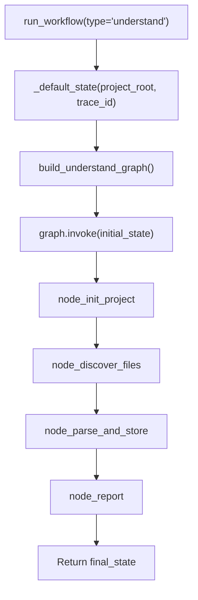

<- Back to [Understand Overview](../UNDERSTAND.md)

# 🏗️ Architecture

## 🔗 Source Code Reference

| File | Purpose |
|------|---------|
| `workflows/understand.py` | Thin facade — re-exports from understand_impl + run_understand_workflow_sync() |
| `core/kgraph/project.py` | `ProjectManager` — project resolution, indexing mode, artifact paths |
| `core/kgraph/storage.py` | `GraphStore` — thread-safe SQLite graph store with WAL mode |
| `core/kgraph/ast_parser.py` | `_parse_dependencies_sync_from_string()` — sync AST-based import extraction |
| `workflows/base.py` | `run_workflow()` — standard dispatcher, routes to `graph.invoke()` |
| `tests/workflows/understand/` | Test files (test_graph, test_state, test_init_project, test_helpers + conftest) |

---

## 🌳 Module Tree

```text
workflows/understand.py                    # Thin facade — re-exports + run_understand_workflow_sync
workflows/understand_impl/
├── state.py                               # UnderstandState TypedDict + _default_state()
├── helpers.py                             # _chunked_md5()
├── graph.py                               # build_understand_graph() + WORKFLOW_METADATA
└── nodes/
    ├── init_project.py                    # node_init_project — ProjectManager init, GraphStore verify
    ├── discover_files.py                  # node_discover_files — os.walk, chunked MD5, changed file detection
    ├── parse_and_store.py                 # node_parse_and_store — AST parsing, edge dedup, GraphStore upsert
    └── report.py                          # node_report — report generation with error logging
```

---

## 🔀 Dispatch Flow



**Key design decisions:**
- **Sync nodes (v1.0)** — All nodes are `def` (sync), not `async def`. Consistent with research, data, autocode, and deep_research workflows. No event loop, no ThreadPoolExecutor, no async complexity.
- **GraphStore lifecycle** — Each node creates its own `GraphStore` instance (thread-local connections), uses it, and calls `.close()` in a `finally` block. No leaked SQLite connections.
- **Chunked MD5** — `_chunked_md5()` reads files in 8KB chunks instead of `read_bytes()`, preventing memory spikes on large files.
- **Deduplicated edges** — Target paths are stored in a `set` before passing to `upsert_file_graph()`, preventing duplicate dependency edges.
- **Trace correlation** — `trace_id` is injected into state by `_default_state()` and read by all nodes via `state.get("trace_id")`. No hardcoded tid strings.
- **Checkpoint/resume** — Routed through `base.py`'s standard `graph.invoke()` path, which handles checkpoint save/restore automatically.

---

## 🧪 Testing

```powershell
.\venv\Scripts\python tests\workflows\understand\ -W error --tb=short -v
```

**Test coverage:**
- Graph compilation
- Default state structure (including trace_id)
- node_init_project: creates dirs, fails without code/ dir
- Trace ID propagation (no hardcoded tid strings)
- Sync node verification (no async def)
- No event loop hacks (no ThreadPoolExecutor, no new_event_loop, no asyncio.gather)
- Chunked MD5 correctness
- completed_with_errors treated as success

---

*Last updated: 2026-07-05 (v1.0 split). See [API.md](API.md) for node details, [CHANGELOG.md](CHANGELOG.md) for version history, [INSTRUCTIONS.md](INSTRUCTIONS.md) for AI editing rules.*
