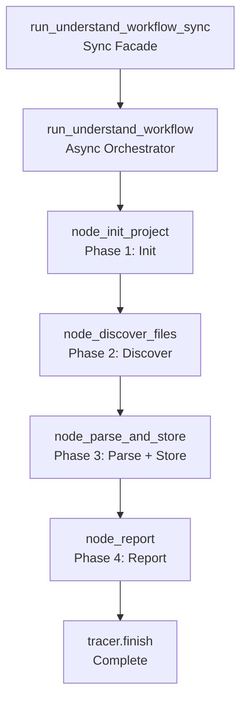

<- Back to [Understand Overview](../UNDERSTAND.md)

# 🏗️ Architecture

## 🔗 Source Code Reference

| File | Purpose |
|------|---------|
| `workflows/understand.py` | `run_understand_workflow_sync()`, `run_understand_workflow()` — sync facade + async orchestrator |
| `workflows/base.py` | `WorkflowState`, `node_step()`, `node_error()`, `node_done()` — shared infrastructure |
| `core/kgraph/project.py` | `ProjectManager` — project resolution and path management |
| `core/kgraph/storage.py` | `GraphStore` — SQLite graph database |
| `core/kgraph/ast_parser.py` | `parse_file_dependencies()` — AST import extraction |
| `tools/report.py` | `report(action="report", title=...)` — report generation |
| `core/config.py` | `cfg.understand_max_file_size_mb`, `cfg.understand_batch_size`, `cfg.understand_timeout_seconds` — config |
| `tests/workflows/understand/test_understand.py` | Full workflow test |

---

## 🌳 Module Tree

```text
workflows/understand.py
├── run_understand_workflow_sync()    # Sync facade (entry point)
│   ├── run_understand_workflow()     # Async orchestrator
│   │   ├── node_init_project()       # Phase 1: Init project + GraphStore
│   │   ├── node_discover_files()     # Phase 2: File discovery + hash check
│   │   ├── node_parse_and_store()    # Phase 3: AST parsing + graph storage
│   │   └── node_report()             # Phase 4: Generate report
│   └── tracer.finish()               # Mark trace complete
```

---

## 🔀 Understand Flow



---

## 💡 Key Design Decisions

- **Not a LangGraph StateGraph** — Unlike other workflows, `understand` is a direct async function call. This is because the workflow is I/O-bound (file discovery, AST parsing) and doesn't need LangGraph's state management.
- **Sync facade** — `run_understand_workflow_sync()` wraps the async orchestrator in a `ThreadPoolExecutor` with a configurable timeout. This provides a sync API for callers.
- **GraphStore per project** — Each project gets its own SQLite database at `artifact_root / "graph.db"`. The database is created lazily on first access.
- **MD5 hash comparison** — Files are only re-parsed if their content hash changes. This enables incremental updates.
- **Batch processing** — Files are parsed in batches of 10 to prevent memory spikes and allow progress reporting.
- **Skip directories** — `node_modules`, `__pycache__`, `.git`, etc. are skipped during file discovery.
- **Memory storage** — Project metadata is stored in procedural memory for future recall.

---

## 🧪 Testing

```powershell
# Run understand workflow tests
.\venv\Scripts\python tests/workflows/understand/ -W error --tb=short -v

> **Note:** Ensure `pytest` resolves to your venv. If not, use `python -m pytest` or the full venv path (`venv\Scripts\pytest.exe` on Windows, `venv/bin/pytest` on Unix).
```

**Mock strategy:**
- Patch `ProjectManager` for project resolution
- Patch `GraphStore` for database operations
- Patch `os.walk` for file discovery
- Patch `hashlib.md5` for hash comparison
- Patch `parse_file_dependencies` for AST parsing
- Patch `report(action="report")` for report generation
- Test `node_init_project` with invalid path -> assert error state
- Test `node_discover_files` with no Python files -> assert empty `files_to_parse`
- Test `node_parse_and_store` with parse error -> assert `"completed_with_errors"` status
- Test `node_report` with empty results -> assert graceful handling

**Test file layout:**
```text
tests/workflows/understand/
└── test_understand.py  # Full workflow test
```

> **Future:** Split into per-node files: `test_node_init.py`, `test_node_discover.py`, `test_node_parse.py`, `test_node_report.py`, plus `conftest.py`.

---

*Last updated: 2026-07-03. See [API.md](API.md) for node reference and output details, [CHANGELOG.md](CHANGELOG.md) for version history, [INSTRUCTIONS.md](INSTRUCTIONS.md) for AI editing rules.*
