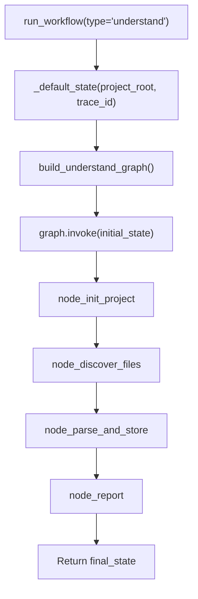

<- Back to [Understand Overview](../UNDERSTAND.md)

# 🏗️ Architecture

## 🔗 Source Code Reference

| File | Purpose |
|------|---------|
| `workflows/understand.py` | Thin facade — re-exports from understand_impl + run_understand_workflow_sync() |
| `core/kgraph/project.py` | `ProjectManager` — project resolution, indexing mode, artifact paths |
| `core/kgraph/storage.py` | `GraphStore` — thread-safe SQLite graph store with WAL mode |
| `core/kgraph/ast_parser.py` | `_parse_dependencies_sync_from_string()` — delegates to tree-sitter (Python) |
| `core/kgraph/tree_sitter_parser.py` | [#4] Multi-language parser: Python, JS/TS, Go, Rust via tree-sitter |
| `core/kgraph/embeddings.py` | `extract_definitions()` (tree-sitter chunking) + `embed_texts()` (LM Studio `/v1/embeddings`) |
| `core/kgraph/vectors.py` | `upsert_file_vectors()` + `query_similar_code()` — ChromaDB vector store |
| `workflows/base.py` | `run_workflow()` — standard dispatcher, routes to `graph.invoke()` |
| `tests/workflows/understand/` | Test files (test_graph, test_state, test_init_project, test_helpers, test_embeddings, test_tree_sitter_parser + conftest) |

---

## 🌳 Module Tree

```text
workflows/understand.py                    # Thin facade — re-exports + run_understand_workflow_sync
workflows/understand_impl/
├── state.py                               # UnderstandState TypedDict + _default_state()
├── helpers.py                             # _chunked_md5()
├── graph.py                               # build_understand_graph() + WORKFLOW_METADATA
└── nodes/
    ├── init_project.py                    # node_init_project — ProjectManager init, GraphStore verify
    ├── discover_files.py                  # node_discover_files — os.walk, chunked MD5, changed file detection
    ├── parse_and_store.py                 # node_parse_and_store — AST parsing, edge dedup, GraphStore + [#3] vector embeddings
    └── report.py                          # node_report — report generation with error logging

core/kgraph/
├── tree_sitter_parser.py                   # [#4] Multi-language parser: Python, JS/TS, Go, Rust
├── embeddings.py                           # [#3] extract_definitions() + embed_texts() (LM Studio)
└── vectors.py                              # [#3] upsert_file_vectors() + query_similar_code() (ChromaDB)
```

---

## 🔀 Dispatch Flow



**Key design decisions:**
- **Sync nodes (v1.0)** — All nodes are `def` (sync), not `async def`. Consistent with research, data, autocode, and deep_research workflows. No event loop, no ThreadPoolExecutor, no async complexity.
- **GraphStore lifecycle** — Each node creates its own `GraphStore` instance (thread-local connections), uses it, and calls `.close()` in a `finally` block. No leaked SQLite connections.
- **Chunked MD5** — `_chunked_md5()` reads files in 8KB chunks instead of `read_bytes()`, preventing memory spikes on large files.
- **Deduplicated edges** — Target paths are stored in a `set` before passing to `upsert_file_graph()`, preventing duplicate dependency edges.
- **Trace correlation** — `trace_id` is injected into state by `_default_state()` and read by all nodes via `state.get("trace_id")`. No hardcoded tid strings.
- **Checkpoint/resume** — Routed through `base.py`'s standard `graph.invoke()` path, which handles checkpoint save/restore automatically.
- **Code embeddings (v1.1)** — `parse_and_store` now populates ChromaDB vector embeddings for each file's top-level definitions (functions, classes, module docstrings). Uses LM Studio's `/v1/embeddings` endpoint (OpenAI-compatible) with GGUF embedding models (e.g. `all-MiniLM-L6-v2-GGUF`, 25MB q8). Per-definition chunking (not per-file or fixed-window) gives the richest semantic search. Graceful degradation: if LM Studio is unavailable, vector indexing is skipped and the workflow completes with graph edges only. Config: `EMBEDDING_MODEL`, `EMBEDDING_BASE_URL`, `EMBEDDING_ENABLED` in `.env`.
- **Multi-language support (v1.2)** — Tree-sitter replaces Python's `ast` module as the parser. One unified API handles Python, JavaScript/TypeScript, Go, and Rust. `discover_files` finds all supported extensions; `parse_and_store` detects the language per file and uses tree-sitter for both import extraction and definition chunking. The old `ast_parser.py` API is preserved (delegates to tree-sitter) for backward compatibility. Adding a new language is a 3-line change in `tree_sitter_parser.py` (add to `LANGUAGE_MAP`, `_IMPORT_NODE_TYPES`, `_DEFINITION_NODE_TYPES`).

---

## 🧪 Testing

```powershell
.\venv\Scripts\python tests\workflows\understand\ -W error --tb=short -v
```

**Test layout:**
```text
tests/workflows/understand/
├── conftest.py                # make_project fixture
├── test_graph.py              # topology + WORKFLOW_METADATA
├── test_state.py              # _default_state structure + trace_id
├── test_init_project.py       # node_init_project
├── test_helpers.py            # _chunked_md5 + sync nodes + trace ID + partial dicts
├── test_embeddings.py         # [#3] extract_definitions + embed_texts + upsert_file_vectors
└── test_tree_sitter_parser.py # [#4] multi-language: Python, JS/TS, Go, Rust
```

**Test coverage:**
- Graph compilation
- Default state structure (including trace_id, vectors_created)
- node_init_project: creates dirs, fails without code/ dir
- Trace ID propagation (no hardcoded tid strings)
- Sync node verification (no async def)
- No event loop hacks (no ThreadPoolExecutor, no new_event_loop, no asyncio.gather)
- Chunked MD5 correctness
- completed_with_errors treated as success
- [#3] AST chunking: function/class/module extraction, line ranges, syntax error fallback
- [#3] Embedding client: LM Studio endpoint mock, graceful failure, disabled flag
- [#3] Vector upsert: delete-then-insert, metadata, graceful degradation
- [#4] Multi-language: import extraction + definition extraction for Python, JS/TS, Go, Rust
- [#4] Language detection: file extension → tree-sitter language name

---

- **Completion pattern** — Unlike `data`/`research` which call `node_done()` in their final node, understand sets `status` in `node_parse_and_store` (`"completed"` or `"completed_with_errors"`). `node_report` is side-effect-only (returns `{}`). The `run_understand_workflow_sync` facade calls `tracer.finish()` itself. This is intentional — understand uses `"completed"`/`"completed_with_errors"` (not `"success"`) to distinguish partial failures.

*Last updated: 2026-07-13 (v1.2.1). See [API.md](API.md) for node details, [CHANGELOG.md](CHANGELOG.md) for version history, [INSTRUCTIONS.md](INSTRUCTIONS.md) for AI editing rules.*
